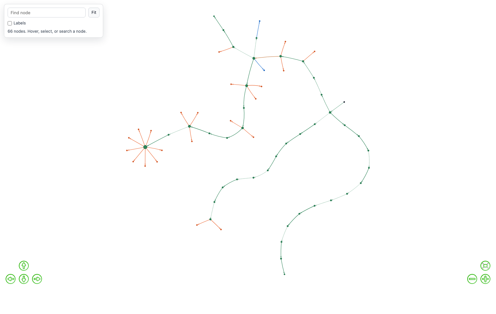
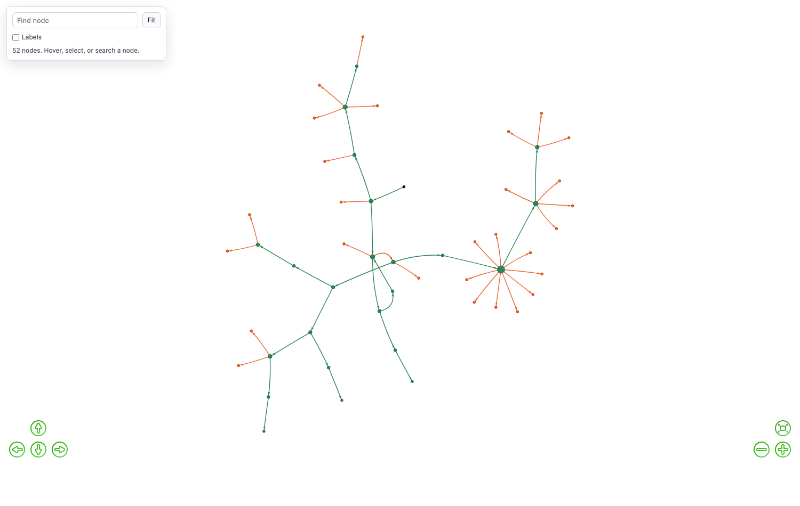
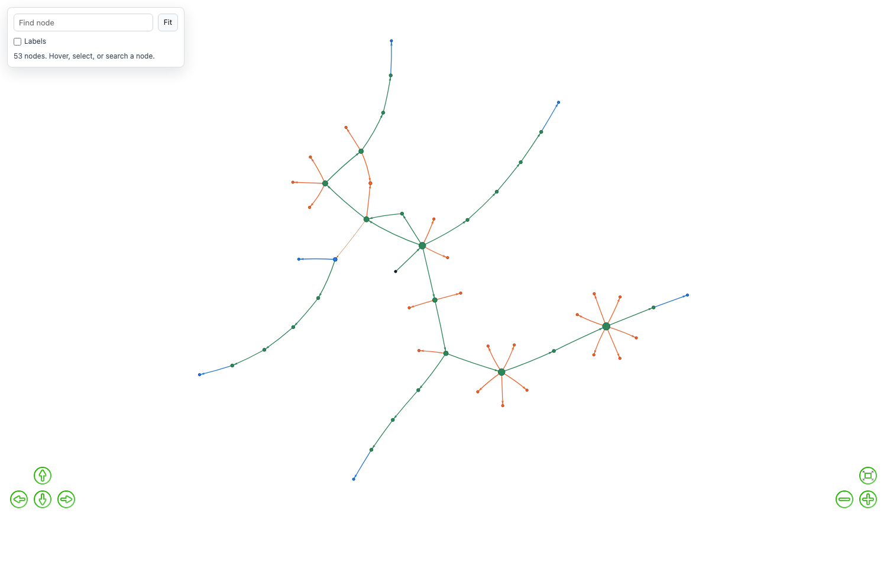
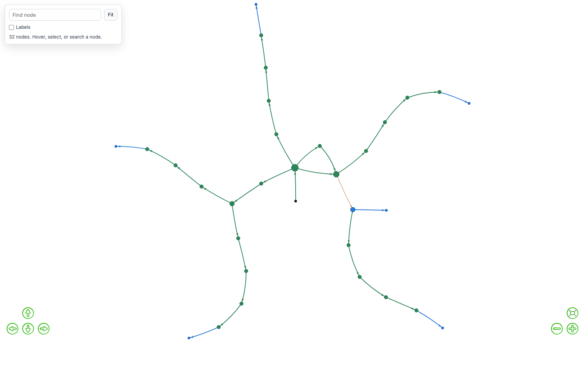
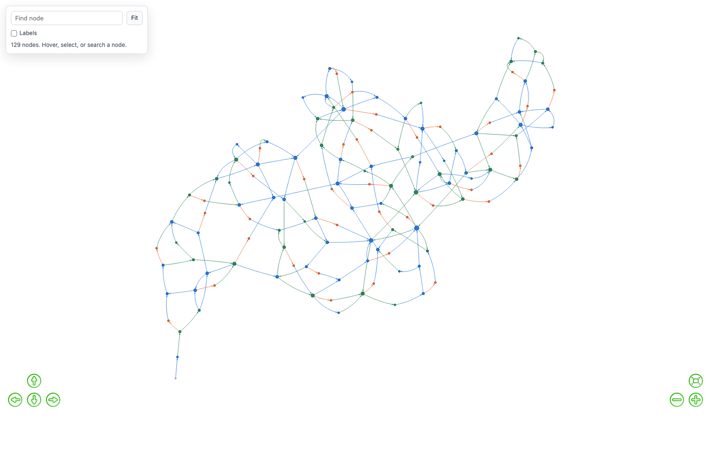

# GoalGraph

**Chat agents that keep a map of what they have tried.**

GoalGraph is a web app for running conversations in which each agent is
pursuing something. As it talks, the agent sets itself a short-range **aim**, a
judge decides each turn whether that aim was reached, evolved, or should be
abandoned, and every one of those decisions is written into a graph belonging to
that agent.

The graph is the point. It is not a log — it is fed back in. When the agent needs
a new aim, it first looks in the graph for a route it already knows, and it is
told which approaches have already been ruled out. Graphs can be saved, merged,
and loaded into a different agent, so what one run learned is available to the
next.

GoalGraph has been in development since 2023. It was built in the Llama-2 era
to stop local agents losing their goals and looping, moved to this repository
in March 2025, and produced the measured demonstrations in
docs/DEMONSTRATION.md in August 2026.

There are two ways to use it:

- **As a chat app.** Two or more agents talk, each pursuing its own goal, and
  you watch the strategy map build up.
- **As an instrument.** Swap the human counterparty for a **keeper**, code holding a hidden rule, and
the agent's claims can be *checked* rather than rated. Verdicts become facts, and every turn exports as a row of CSV.

---

## What it does, measured

Everything below was measured on the shipped code, with a small open model
(llama-3.2-3B) acting and gpt-5.4 judging, on the hidden-rules sentence task
(`constraints`).

### The scaffold

| | no scaffold | full system |
|---|---|---|
| solved | 1/20 | **9/20** |
| near-duplicate messages | 0.27 | 0.15 |
| longest repeat streak | 7.0 | 2.9 |

### A paved graph

| | unaided 3B | 3B + paved graph |
|---|---|---|
| accepted answers per session | **0.00** (19 sessions, none) | **0.80** (z = 3.03) |
| full solves | 0/19 | 3/20 |

The proven **template** transfers: 18 of 19 accepted answers followed the
sentence shape the donor graph proved.

Agents take a graph aim on **96% of choices** when allowed to pick.

See [docs/DEMONSTRATION.md](docs/DEMONSTRATION.md) for the full set and the
reproduction scripts.

---

## Contents

- [What it does, measured](#what-it-does-measured)
- [What a graph looks like](#what-a-graph-looks-like)
- [How to read a graph](#how-to-read-a-graph)
- [How it works](#how-it-works)
- [Configuring a run](#configuring-a-run)
- [Run data](#run-data)
- [Features](#features)
- [Architecture](#architecture)
- [Project structure](#project-structure)
- [Getting started](#getting-started)
- [API reference](#api-reference)
- [Further reading](#further-reading)
- [License](#license)

---

## What a graph looks like

These are real graphs from real runs, drawn by the app's own **Graph** tab. They
are here to set expectations about what the software produces, not to make a
claim about any result.

A graph part-way through a long run. Green chains are the agent advancing; the
orange fans are aims it ruled out and did not revisit.



Dense refutation is normal, not a malfunction. A run that tests many hypotheses
and discards most of them looks like this — a few green spines with orange
sprays hanging off the nodes where the agent was working hardest.



Blue nodes mark aims that were actually reached, so a graph with blue in it is
one where something completed.



### Hiding ruled-out aims

Refuted aims are usually the majority of the picture, so the **Hide ruled-out
aims** checkbox above the viewer is often the only way to see the route that was
actually taken. This is the same graph as the one above with the box ticked —
fifty-three nodes become thirty-two, and what is left is the spines and their
endpoints.



The single amber edge is a route that later experience contradicted. It keeps
its label and loses confidence rather than disappearing, so you can see that the
graph has become doubtful about it.

---

## How to read a graph

Everything in the picture is carrying information. Nothing is decorative.

**Node colour** — set by the verdict on the edge that arrives at it:

| colour | meaning |
|---|---|
| near-black | `start`. Every graph begins here. |
| **green** | **Progress** — the aim evolved into a better or more specific one, and the run went on from here. |
| **blue** | **Go** — the aim was reached. |
| **orange** | **NoGo** — the aim was ruled out. |
| pale grey | nothing has been decided about this node yet. |

**Node size** grows with the number of edges meeting at it, so hubs are where
the agent spent its effort.

**Edge colour** follows the same scheme by label, with one addition: an
**amber** edge is one that later experience contradicted. It keeps its original
verdict and drops in confidence, so a reused graph shows routes that have become
doubtful rather than ones that silently changed their mind.

**Edge thickness** is confidence — the width is `1 + 4 × confidence`, so a
well-supported verdict is visibly heavier than a marginal one.

**Solid or dashed** is the thing worth learning first:

- **solid** — checked against evidence. A keeper, or the agent's own test
  applied to an observation, settled this.
- **dashed** — the LLM judge's opinion.

A proven refutation should not look like a hunch, so it doesn't.

**Arrows** point in the direction the agent travelled.

### Structure tells you something too

Depth only increases on a `Go` or a `Progress`. So the shape of a graph is
informative before you read a single label:

- **A route**, chains of green and blue running outward from `start`, means the
  agent kept advancing.
- **A star**, one hub with nothing but orange spokes, means it never advanced.
  It re-derived dead ends until its turns ran out.

### Getting around a large graph

The viewer has a small explorer panel, top left:

- **Find node** — type to search node labels, with autocomplete.
- **Fit** — zoom the whole graph back into view.
- **Labels** — on or off. On automatically for graphs of 20 nodes or fewer;
  off above that, because a hundred labels is a wall of text.
- **The detail panel** shows the node count, and once you hover or select a
  node, its incoming and outgoing neighbours as buttons — click them to walk the
  graph one hop at a time.
- Hovering an edge shows its verdict, its confidence, whether it was checked or
  judged, and how many times it has been seen.
- Arrow pad and zoom controls sit in the corners; nodes can be dragged.

---

## How it works

### The turn loop

With `aim_system` on, each time an agent takes a turn:

1. **Pick an aim.** If the agent has no active aim, the system searches the
   graph for a known route toward its goal. If it finds one, the next node on
   that route becomes the aim. If not, the LLM writes a new aim — and is told
   which approaches have already been ruled out, so it doesn't propose them
   again.
2. **Respond.** The agent generates a reply in character, with its current aim
   and suggested action in the prompt.
3. **Judge it.** A separate, lightweight LLM call rates progress on the aim from
   1 to 7.
4. **Record the verdict.** The rating becomes a `Go`, `Progress`, or `NoGo`
   edge in the agent's graph.

```
                        ┌──────────────┐
                        │  Start Node  │
                        └──────┬───────┘
                               │
                    ┌──────────▼──────────┐
                    │    Generate Aim     │◄──── Check the graph for a known
                    │  (or follow a route)│      route (embedding search)
                    └──────────┬──────────┘
                               │
                    ┌──────────▼──────────┐
                    │  Agent Response     │◄──── Aim + suggestion in prompt
                    │  (LLM generation)   │
                    └──────────┬──────────┘
                               │
                    ┌──────────▼──────────┐
                    │  Judge Review       │──── Rating 1–7
                    └──────┬─────┬────────┘
                           │     │
                  Rating≥6 │     │ Rating≤2, regression,
                  (Go)     │     │ or out of patience (NoGo)
                    ┌──────▼─┐ ┌─▼────────────┐
                    │Go Edge │ │NoGo Edge      │
                    │→ next  │ │→ {aim}_NoGo   │
                    │ aim    │ │  (try again)  │
                    └────────┘ └───────────────┘
```

### When each verdict fires

| verdict | condition |
|---|---|
| **Go** | rating ≥ 6 — the aim was reached |
| **Progress** | the aim evolved into a better or more current one |
| **NoGo** | rating ≤ 2, once the aim has had its minimum run |
| **NoGo** | the score dropped by more than a point *and* the rating is ≤ 4 — going backwards |
| **NoGo** | out of patience — stuck too long, forced abandonment |

Two per-agent settings control how long an aim gets:

| setting | what it does |
|---|---|
| `persistance` | minimum turns before a `NoGo` can fire, even on bad ratings. Gives an aim a fair run. |
| `patience` | maximum turns before a `NoGo` is forced regardless of rating. Stops infinite loops. |

The shipped starter session uses `persistance` 4 and `patience` 8; agents
created without those fields fall back to 3 and 6. Low values (say 1 and 2)
produce many edges quickly, which is what you want when you are building a graph
to look at rather than a conversation to read.

### What an edge weight means

The weight on every edge is a **confidence between 0 and 1** — how much this
verdict should be trusted. One number, read by everything.

| where the verdict came from | confidence |
|---|---|
| checked against evidence — a keeper, or the agent's own test applied to an observation | `1.0` |
| the LLM judge | `0.3` plus `0.075` for each point the rating sits away from the midpoint of 4, capped at `0.6` — so `0.30` for a rating of 4, `0.525` at either extreme |

Opinion is deliberately held below certainty so that no rating, however
confident, can outrank something that was actually checked.

**Confidence accumulates across visits.** When an edge is seen again, agreement
moves it toward 1 and contradiction toward 0, both at rate `1/visits`. The second
visit moves the estimate halfway; the tenth barely moves it at all. A route
confirmed four times dents to `0.80` on one contradiction, while a route seen
once drops to `0.50`. A contradicted edge keeps its label, records `contested`,
and renders amber — doubted, not deleted.

**For pathfinding**, confidence is turned into a cost: `1.1 − c` for a route and
`1 + 10c` for a dead end. A well-supported route is cheap to take, and a *proven*
dead end is avoided far more strongly than a doubtful one. Costs never reach
zero, because a free edge would win every search regardless of merit.

### Node and edge types

| node | example | meaning |
|---|---|---|
| `start` | `start` | where every graph begins |
| aim | `negotiate 50% discount` | a goal, hypothesis, tactic, or next step |
| NoGo | `negotiate 50% discount_NoGo` | a ruled-out approach, recorded so it is not retried |

| edge | direction | meaning |
|---|---|---|
| `Go` | current → aim | the aim was reached |
| `Progress` | current → aim | the aim evolved into a better one |
| `NoGo` | current → `{aim}_NoGo` | the approach failed |
| `Similar` | both ways, weight `0.1` | two nodes mean nearly the same thing (cosine similarity > 0.8). Created during merges. |

### Reusing what is in the graph

**Semantic search.** Node labels are embedded with `all-MiniLM-L6-v2`
(sentence-transformers, 384 dimensions, cached). To find a route, the agent's
goal text is embedded, cosine similarity picks the closest node in the graph,
and `nx.shortest_path` routes there from wherever the agent currently is, using
the confidence-to-cost conversion above. The next node on that path becomes the
new aim. This is what lets an agent recognise that a strategy it already knows
applies to a situation worded differently.

**Import.** One agent's graph can be pulled into another's, with an optional
namespace prefix to avoid name collisions (`alex::negotiate discount` versus
`jordan::negotiate discount`). Where edges collide, the cheaper one is kept.

**Merge.** Several saved graphs can be composed into one shared graph, which
keeps a record of its sources.

**Similarity linking.** After a merge, `link_similar_nodes()` compares every pair
of node embeddings and joins the ones above a threshold (default 0.8) with a
`Similar` edge. That lets pathfinding cross between experiences that started out
as separate graphs, even when the wording never matched.

---

## Configuring a run

The **Decision Graph** panel in the sidebar holds the settings that decide what
the graph does. They are in the UI rather than in code because a run is only
interpretable if you can see how it was configured — and every one of them is
written onto every row of the exported data.

### Aim system

`aim_system` turns the aim scaffold on or off. Off ablates the scaffold
entirely: there is no aim, no judge review, and no graph writes. The keeper and
the conversation are untouched.

### Task

`chat` is ordinary conversation: no keeper, nothing checkable. The rest pair the
agent with code that holds a hidden rule, so its claims can be tested.

| task | the counterparty | what an aim is |
|---|---|---|
| `chat` | a person or another agent | a strategy. Nothing is decidable. |
| `rule_induction` | code holding a hidden rule about number triples | a hypothesis. Refutation is a proof. |
| `word_induction` | code holding a hidden rule about single words | a hypothesis about spelling and letters |
| `sentence_induction` | code holding a hidden rule about whole sentences | a hypothesis over a much larger feature space |
| `transformation` | code holding a hidden constraint on legal states | an intermediate state on the way to a goal |
| `constraints` | code holding several hidden rules that must all hold | a belief about one of the rules |
| `troubleshoot` | code holding a hidden fault | a belief about where the fault is |
| `diagnosis` | another agent — a patient with a hidden condition | a belief about which condition |
| `clinic` | another agent — a reserved patient, criteria-based | a criterion, pinned down or ruled out |
| `ddx_clinic` | the clinic game built from the public DDXPlus corpus (CC-BY-4.0) | as `clinic`, but with real conditions and symptoms, and guarded facts whose indirect routes are measured from patient co-occurrence rather than chosen |
| `hidden_norm` | code deciding warm or flat replies from a hidden property of your message | a hypothesis, tested through dialogue |

Each task offers a choice of **hidden rule**, listed in a second dropdown. The
agent is never told it. It is what the keeper checks claims against, which is
what makes a verdict a fact rather than an opinion.

`task_variant` selects a named variation interpreted by the task's own module.
The shipped `ddx` variant is `stateful_patient`: the patient keeps the full
conversation regardless of the session window and never repeats an answer.

Tasks and their rules are served from the Python side at `/api/run_types`, so a
rule you add appears in the panel without rebuilding the frontend.

### What the agent is told about ruled-out aims

`graph_memory_mode` decides what, if anything, comes back from the graph. The
four modes are a comparison, not a ranking — running the same task under each is
how you find out whether the graph earns its keep.

| mode | UI label | what reaches the prompt | cost |
|---|---|---|---|
| `none` | Off | nothing. The graph is still recorded when `aim_system` is on. | zero — the control arm |
| `inline` | Said once | the refutation is stated once, in the conversation, then left to scroll out of the window | one sentence, once |
| `description` | Full list | every ruled-out aim, re-inserted every turn, no reasons and no filtering | grows with the graph — around 6,400 characters once 137 aims are ruled out |
| `graph` | Retrieval | the nearest few ruled-out aims, each with the observation that killed it | fixed by the two limits below, not by graph size |

In `graph` mode, two extra sliders appear: **aims recalled per turn**
(`graph_recall_k`, default 4) and a **character budget** (`graph_recall_chars`,
default 600). The budget is a hard ceiling — aims past it are dropped and the
agent is told how many were left out, so it knows the list is partial.

### Who decides the next aim

When an aim finishes, the agent either follows a route the graph already knows
or invents a new aim. By default that fork is settled by one number: the
route's similarity to the goal multiplied by `graph_trust`, against
`route_min_score` (0.40).

That product latches off. A failed route multiplies trust by `TRUST_DECAY`
(0.6), so after one failure routing needs a similarity of 0.67 and after two it
needs 1.1, which is unreachable — node-label-to-goal-brief similarity tops out
near 0.46. The trust values in the recorded runs are exactly 0.6ⁿ, so this is
observed rather than argued. `TRUST_FLOOR` is commented "never quite stop
listening to the graph"; against a 0.40 gate it means the opposite.

There is a deeper reason routing rarely fires, underneath the latch and
independent of it. `find_path_to_goal` finds the node most similar to the goal
and then demands a **directed path** to it. The graph accumulates as a near-tree, 54 nodes and 53 edges on a full eight-
patient sequence, so a node is reachable only from its own ancestors. On that graph the nearest-goal node
scores 0.515, comfortably above every threshold in the code, and a path to it
exists from **6 of 53 nodes**. Trust at 1.0 and a good similarity still leave
nine turns in ten with no route at all. The gate is not merely latched; most of
the time it has nothing to offer.

`aim_fork_mode` chooses who settles the fork:

| mode | who decides | what it is for |
|---|---|---|
| `gate` | `similarity × trust ≥ route_min_score` | the shipped behaviour, and the control |
| `judgement` | the agent, from the graph's candidates, with only the conversation | separates "let the agent decide" from "give it a memory" — without it, any gain could be the extra model call |
| `scratchpad` | the agent, plus a running note it rewrites each turn | the note is capped by the same `graph_recall_chars` retrieval spends |

Both arbitrated modes see candidates drawn from the same sources: the next step
on a known path with its similarity when one exists, the aims already reached
from here, and, because the first is usually absent, the most relevant live aims
anywhere in the graph. Adopting an aim is not traversing an edge, and the path
requirement is an artefact of modelling aims as a route rather than a set.

`candidate_ranking` controls which candidates are offered and how they are
described. `similarity` uses the ordinary candidates. `grooved` never offers
`INHERITED` candidates below a similarity floor of 0.30, while nodes created by
the current run are always offered. It annotates every candidate with its groove,
meaning proven `Go` or `Progress` evidence with confidence weighted by visits,
and its edge-distance to the goal-nearest node. These are annotations only; the
ordering is unchanged.

A keeper-verified advance automatically stamps its node with the move that
proved it in `proof_move`. When an agent adopts such an aim, `aim_proof` keeps
that proof in its prompt for as long as it holds the aim.

`aim_source` is still recorded honestly: `graph_path` when the agent takes a
place from the graph, `carried` when it invents one; and `fork_choice_kind`
says which kind it took, so taking a genuine walkable path stays countable on
its own and comparable with runs made before any of this existed. Trust is
deliberately not shown to the agent: it is the artefact being removed, and
naming it in the prompt would reintroduce the latch by another route. The fork
costs one model call each time it fires; `fork_context_chars`, `fork_outcome`,
`fork_candidates`, `fork_path_offered` and `fork_choice_kind` record what it
read, what was on offer and what it did. If the call fails or the reply cannot
be parsed, the fork falls back to the gate, so a failure costs a decision
rather than the run.

### Context window

`context_window` caps how many recent messages the judge and the subgoal planner
may each see, and supplies the default window for each agent. Each component is
told how many messages are hidden rather than left to assume it has everything.
`0` means the whole conversation.

An agent row may carry its own `context_window`, where `0` is unlimited. This
overrides the session window for that agent's own prompt without changing the
judge's, the planner's, or another agent's window.

This is the setting that decides whether stored aims are worth anything. While
the relevant history is still on screen, the agent can simply re-read what
failed; a memory of refutations only starts paying once something has scrolled
out of view.

### Verdict gating

**Let the judge abandon an aim before it matures** (`nogo_ungated`), off by
default. Off, only a refutation the keeper settles from evidence may skip the
minimum persistence — a fact needs no waiting period, an opinion does. On, the
judge can also abandon an aim on its first bad rating, which tends to collapse
the graph into a hub of dead ends with no `Go` edges at all, because no aim
survives long enough to progress. Regression and impatience always wait either
way.

### Move guard

`move_guard` turns near-repeat checking on or off. When it is on and the keeper
recognises a draft's move as a near-repeat of one already rejected, the draft is
regenerated once with the refutation named. Fires are recorded per turn in
`move_guard_fired`.

### Carrying a graph between runs

A graph is only worth building if it can outlive the session that built it. Save
it to the graph library, then start a fresh agent from it:

```
POST /api/saved_graphs/<graph_id>/load_into/<agent_id>
```

By default every carried-over aim is marked **unverified**, and recall says so —
*"learned under a different setup, treat as unconfirmed and worth re-testing."*
That default matters: a verdict established under one configuration is a claim
under another, not a fact, and an agent that trusts a stale `NoGo` will suppress
an approach that now works. Pass `trust: true` when you know the setup is
identical.

---

## Run data

Every judged turn is recorded. **Decision Graph → Download this run as CSV**
exports them, one row per turn.

The per-run settings columns are:

```
session_id, run_label, provider, model, temperature, graph_memory_mode,
graph_recall_k, graph_recall_chars, context_window, run_type, task_variant,
keeper_rule, nogo_ungated, aim_fork_mode, order_salt, aim_system,
candidate_ranking, move_guard
```

The per-turn columns are:

```
turn, agent, aim, aim_source, rating, aim_status, next_aim, history_len,
keeper_move, keeper_verdict, llm_calls, input_tokens, output_tokens,
tokens_estimated, aim_chosen_this_turn, stated_rule, verdict_source,
persistence_count, graph_contribution_chars, fork_context_chars,
fork_outcome, fork_candidates, fork_has_path, fork_path_sim,
fork_path_offered, fork_choice, fork_choice_kind, fork_choice_hops,
fork_choice_groove, move_guard_fired, holdout_accuracy, graph_trust,
graph_nodes, graph_edges, justification
```

Two columns carry most of the interpretive weight:

- **`verdict_source`** is `evidence` where a keeper settled the claim in code and
  `judge` where it is an LLM's opinion. It tells you how much of the graph is
  fact.
- **`graph_contribution_chars`** is how many characters the memory actually put
  into that turn's prompt — the retrieved aims, plus whatever the aim fork read
  on turns where it ran. **If it is 0, the memory never engaged and the run is
  not a test of anything.** Check it before believing any comparison.

`stated_rule` holds whatever structured claim the agent was asked for: the
keeper's checkable rule where there is one, and the scratchpad on the tasks
where there is not. Only one of the two is ever requested on a given run, so the
column stays unambiguous — but it means an empty `stated_rule` on a clinical
task tells you the scratchpad was off, not that the agent said nothing.

Two columns describe the aim, and they are not the same thing.
`aim_chosen_this_turn` is what decided *this* turn's aim. `aim_source` is the
source last set at the post-verdict fork, which persists across turns until the
next verdict — so it does not see the Step-1 routing that happens when an aim
has just been abandoned. Both were once spelled `aim_source` in the same dict
literal, so the first was silently dropped for the whole history of the
project; the older column keeps its meaning so prior results stay comparable.

`fork_context_chars` and `fork_outcome` are non-empty only on the turns where
the aim fork ran, and only when `aim_fork_mode` is not `gate`. `fork_outcome` is
`graph_path` when the agent took a place from the graph, `carried` when it
named its own, and `fell_through` when it could not decide and the trust gate
settled it after all — which is worth reading before crediting the setting with
a change, since a fork that always falls through is the old mechanism wearing a
new name.

`aim_source` says whether the graph or the judge supplied each aim.
`keeper_verdict` is ground truth. Token counts cover every model call in the pipeline, including agent, judge,
and planner, because they are recorded at the single point all three pass
through.

The settings are repeated on **every row** rather than written once in a header,
so exports from runs under different settings can be concatenated into one file
and grouped without any reshaping. Give each arm a different **run label**, and
use **Start new run** to clear the recorded turns so what follows exports on its
own — it marks a boundary in the data and leaves the conversation and the graph
alone.

`?format=json` on `/export_run_data` returns the same rows as JSON.

---

## Features

### Conversation modes

**You + Agent** — you talk to one agent directly. It responds in character while
pursuing its goal; when `aim_system` is on, the aim system, judge, and graph all
run behind the scenes.

**Agent vs Agent** — two or more agents talk to each other and you act as
narrator, setting the scene. Each pursues its own goal with its own graph, which
is the setup for studying negotiation, debate, and whatever emerges.

### Rapid runs

Tick **Rapid** in the chat footer before pressing **Play**. It removes the
client-side turn delay and sets the judge delay to zero, while leaving provider
retry and backoff intact for real rate limits. To build a dense graph fast:

1. Create two agent presets with opposing goals.
2. Give each a fast model in the Agent Library.
3. Set `persistance` and `patience` low — 1 and 2.
4. Start an Agent vs Agent chat, set a high turn count, tick Rapid, press Play.
5. Save both graphs afterwards, and merge them to compare strategies.

### Agent library

Reusable agent presets:

| field | purpose |
|---|---|
| Agent Name | display name in conversations |
| Description | personality, background, behaviour |
| Goal | what the agent is trying to achieve |
| Target Impression | how it wants to be perceived |
| LLM Provider / Model | which model this agent runs on |
| Context Window | recent messages available to this agent's own prompt; `0` is unlimited |
| Persistence / Patience | how quickly it abandons or completes aims |

Setting a provider and model on a preset flips its
`is_agent_generation_variables` flag, and that agent's calls route through its
own provider instead of the session default — so you can put different models
against each other in the same conversation.

### Graph library

The **Graph** tab shows any active agent's graph in the interactive viewer
described above, with the **Hide ruled-out aims** toggle. From there you can
save a graph to the library; browse saved graphs with their node and edge
counts; visualise any of them; select several and merge them into a new one; or
delete them.

Six seed graphs ship in `examples/graphs/`:

| file | contents |
|---|---|
| [`subscription_retention.graphml`](examples/graphs/subscription_retention.graphml) | customer-retention negotiation with discount paths and failed save tactics |
| [`water_rights_dispute.graphml`](examples/graphs/water_rights_dispute.graphml) | resource dispute with monitoring, mediation, and legal-pressure branches |
| [`security_red_team.graphml`](examples/graphs/security_red_team.graphml) | security drill: investigation, control gaps, mitigations, unsafe dead ends |
| [`procurement_negotiation.graphml`](examples/graphs/procurement_negotiation.graphml) | buyer–vendor negotiation over price, risk, legal terms, rollout |
| [`adversarial_use_cases_showcase.graphml`](examples/graphs/adversarial_use_cases_showcase.graphml) | merged multi-domain map with semantic links across scenarios |
| [`detailed_adversarial_strategy_map.graphml`](examples/graphs/detailed_adversarial_strategy_map.graphml) | a 129-node workspace, below |



Every edge here is dashed, because these are hand-authored seed graphs — nothing
in them was checked against a keeper.

### Providers

| provider | models | auth |
|---|---|---|
| OpenAI | GPT-4o, GPT-4o Mini, GPT-4 Turbo, GPT-3.5 Turbo | `OPENAI_API_KEY` |
| OpenAI Codex | GPT-5.6 Sol / Luna / Terra, GPT-5.5, GPT-5.4, GPT-5.4 Mini, GPT-5.3 Codex Spark | `~/.codex/auth.json` (ChatGPT subscription OAuth) |
| Anthropic | Claude Sonnet 4, Claude 3.5 Sonnet, Claude 3.5 Haiku | `ANTHROPIC_API_KEY` |
| Cohere | Command R+, Command R | `COHERE_API_KEY` |
| HuggingFace | Mistral 7B Instruct | `HUGGINGFACE_API_KEY` |
| Local | any GGUF model via `llama_cpp` | local file path |

`judge_provider` and `judge_model` run the judge, planner, and fork arbiter on a
different model from the acting agent.

If the chosen provider fails, the system falls back in order:
openai-codex → openai → anthropic → cohere → local. Rate limits (429) retry with exponential backoff: 2s, 4s, 8s, 16s, honouring
`Retry-After` when the provider sends it. With `strict_provider` on, a provider failure fails the run
instead of silently falling back to another provider.

Generation parameters, settable per session or per agent: `temperature`,
`max_tokens`, `top_p`, `top_k`, `repetition_penalty`, `seed`, `use_gpu`.

### Sessions

Create, duplicate, rename, reset, and delete sessions from the sidebar; load any
past chat. Each session is a file (`{session_id}_state.json` in `chat_cache/`)
holding the full history, agent states, graph paths, and configuration, which
makes a session portable and inspectable without the app running.

### Developer tools

The Developer tab shows a full JSON dump of the current session state and the
server log, with configurable auto-refresh (default 3s) and download/clear
buttons.

---

## Architecture

```
┌─────────────────────────────────────────────────────────────┐
│                      Frontend (React 17)                     │
│  ┌──────────┐ ┌──────────┐ ┌──────────┐ ┌───────────────┐  │
│  │   Chat   │ │  Agent   │ │  Graph   │ │   Decision    │  │
│  │Interface │ │ Library  │ │ Library  │ │    Graph      │  │
│  └────┬─────┘ └────┬─────┘ └────┬─────┘ └───────┬───────┘  │
│       │            │            │               │           │
│  ┌────▼────────────▼────────────▼───────────────▼───────┐  │
│  │             SessionContext (React Context API)        │  │
│  └───────────────────────┬───────────────────────────────┘  │
│                          │  api.js                          │
└──────────────────────────┼──────────────────────────────────┘
                           │ HTTP/JSON
┌──────────────────────────┼──────────────────────────────────┐
│                    Backend (Flask + Waitress)                │
│  ┌───────────────────────▼───────────────────────────────┐  │
│  │                    app.py (routes)                     │  │
│  │   /submit  /generate  /export_run_data  /api/…        │  │
│  └───┬──────────┬──────────────┬──────────────┬──────────┘  │
│      │          │              │              │              │
│ ┌────▼────┐ ┌───▼──────────┐ ┌─▼───────────┐ ┌▼──────────┐  │
│ │agent.py │ │graph_intel.  │ │graph_memory │ │keeper.py  │  │
│ │  Aims   │ │  Embeddings  │ │  Recall     │ │Hidden rule│  │
│ │Go/NoGo  │ │  Pathfinding │ │  Confidence │ │Verdicts   │  │
│ │Judge    │ │ Import/Merge │ │  Budgets    │ │from code  │  │
│ └────┬────┘ └───┬──────────┘ └─┬───────────┘ └┬──────────┘  │
│      │          │              │              │              │
│ ┌────▼──────────▼──────────────▼──────────────▼───────────┐ │
│ │         NetworkX DiGraph + GraphML files                 │ │
│ │         Session JSON + agent library JSON                │ │
│ └──────────────────────────────────────────────────────────┘ │
└──────────────────────────────────────────────────────────────┘
```

- **Frontend** — React 17 + Webpack 5, Context API for state, Lucide icons
- **Backend** — Flask served by Waitress
- **LLM access** — one abstraction layer with retry, fallback, and per-agent routing
- **Graphs** — NetworkX directed graphs, `all-MiniLM-L6-v2` embeddings
- **Visualisation** — PyVis HTML in an iframe, with the explorer panel injected
- **Storage** — files on disk; no database

## Project structure

```
GoalGraph-Agents/
├── src/
│   ├── app.py                      # Flask routes, session handling, graph rendering
│   ├── defaults_session.json       # Starter session and agents
│   ├── agent/
│   │   ├── agent.py                # Aims, the judge, the Go/Progress/NoGo loop
│   │   ├── graph_intelligence.py   # Embeddings, pathfinding, import/merge/linking
│   │   ├── graph_memory.py         # Recall, confidence, budgets
│   │   ├── keeper.py               # Hidden rules and evidence-checked verdicts
│   │   ├── llm_service.py          # Multi-provider LLM layer
│   │   ├── schemas.py              # JSON schemas for responses, ratings, aims
│   │   └── *_rules.py              # One rule set per task (induction, clinic, …)
│   ├── components/                 # React UI
│   ├── contexts/                   # SessionContext, AgentContext
│   ├── services/                   # api.js and friends
│   ├── styles/main.css
│   ├── static/                     # Built bundle and generated graph HTML
│   └── chat_cache/                 # Sessions, agent presets, graphs
├── studies/                        # Scripted runs — the UI driven over HTTP
├── docs/                           # Worked example and development notes
├── examples/graphs/                # Seed GraphML files
├── screenshots/
└── requirements.txt
```

## Getting started

### Prerequisites

- Python 3.8+
- Node.js 14+ and npm
- An API key for at least one provider, or a Codex subscription login

### Install

```bash
git clone https://github.com/maracman/GoalGraph-Agents.git
cd GoalGraph-Agents
```

```bash
python -m venv venv && source venv/bin/activate   # Windows: venv\Scripts\activate
pip install -r requirements.txt
```

```bash
cd src && npm install && npx webpack --config webpack.config.js --mode development && cd ..
```

Set at least one key:

```bash
export OPENAI_API_KEY=your_key
export ANTHROPIC_API_KEY=your_key
```

### Run

```bash
cd src && python app.py
```

Then open `http://localhost:5000`.

To try it without any API key, using simulated responses:

```bash
cd src && OFFLINE_MODE=true python app.py
```

### First run

1. In the **Agent** tab, create two presets with opposing goals. Give each a
   name, description, and goal, and optionally its own provider and model.
2. **New Chat** in the sidebar → pick **Agent vs Agent** → select both agents.
3. Set a turn count, tick **Rapid**, press **Play**.
4. Watch the **Graph** tab fill in. Tick **Hide ruled-out aims** to see the route.
5. Save a graph you like to the library, and merge it with another later.

To use it as an instrument instead, open **Decision Graph**, pick a task other
than `chat`, choose a hidden rule, set a memory mode and a context window, and
run. Then export the CSV.

## API reference

### Session and chat

| method | route | description |
|---|---|---|
| GET | `/get_session_id` | get or create a session ID |
| GET | `/check_session` | current session state |
| GET | `/get_session_settings` | current settings, with defaults if no session yet |
| POST | `/submit` | submit a message; optional `max_turns`, `fast_graph_run` |
| GET | `/generate` | generate one agent turn |
| POST | `/interrupt` | stop the generation loop |
| GET | `/get_past_chats` | list saved sessions |
| POST | `/create_new_chat` | new session; accepts mode, presets, graph assignments |
| GET | `/load_chat/<chat_id>` | load a past session |
| POST | `/duplicate` · `/rename_chat` · `/reset` · `/delete_chat` | session housekeeping |
| POST | `/set_chat_mode` | switch between You + Agent and Agent vs Agent |
| POST | `/export_chat_json` | export the conversation |

### Agents

| method | route | description |
|---|---|---|
| GET | `/get_agents` | agents in the current session |
| POST | `/add_agent` · `/save_agent_settings` · `/delete_agent` | manage them |
| POST | `/toggle_agent_mute` | mute or unmute an agent |
| POST | `/respond_as_agent` | write a turn on an agent's behalf |
| POST | `/delete_last_response` | undo the last turn |
| GET/POST | `/api/agent_library` | list or create presets |
| PUT/DELETE | `/api/agent_library/<preset_id>` | update or delete a preset |

### Graphs

| method | route | description |
|---|---|---|
| GET | `/get_agent_graphs` | active agents with node and edge counts |
| GET | `/visualize_pyvis?agent_id=X&hide_nogo=1` | render an agent's graph |
| GET | `/graph_info/<agent_id>` | stats, nodes, edges, and path-to-goal |
| POST | `/import_graph` · `/combine_graphs` · `/save_graph` | import, merge, save |
| GET | `/api/saved_graphs` | the saved library |
| POST | `/api/saved_graphs/from_agent/<agent_id>` | save an agent's graph |
| GET | `/api/saved_graphs/<graph_id>/visualize` | render a saved graph |
| POST | `/api/saved_graphs/<graph_id>/load_into/<agent_id>` | start an agent from a saved graph; `trust: true` to skip the unverified mark |
| POST | `/api/saved_graphs/merge` | merge several into a new one |
| DELETE | `/api/saved_graphs/<graph_id>` | delete one |

### Runs and settings

| method | route | description |
|---|---|---|
| GET | `/api/run_types` | tasks this build offers, and each one's hidden rules |
| POST | `/update_user_settings` | task, rule, variant, aim system, memory mode, candidate ranking, move guard, window, gating, run label |
| POST | `/reset_run_trail` | clear recorded turns — marks a boundary between arms |
| GET | `/export_run_data` | the CSV; `?format=json` for the same rows as JSON |
| GET | `/get_llm_providers` · `/get_llm_models?provider=X` | what is available |
| GET/POST | `/get_llm_settings` · `/update_llm_settings` | session LLM configuration |
| POST | `/test_llm_configuration` | check a provider actually answers |
| POST | `/update_generation_parameters` | temperature, tokens, seed, and the rest |
| GET | `/logs` | server log |

---

## Further reading

The README describes the software. The research built with it lives elsewhere:

- **[docs/DEMONSTRATION.md](docs/DEMONSTRATION.md)** — what the software does,
  measured, with the script that reproduces each demonstration.
- **[docs/TOY_RESEARCH_PROJECT.md](docs/TOY_RESEARCH_PROJECT.md)** — a worked
  example, start to finish: an agent that interviews and remembers what it ruled
  out.
- **[docs/DEVELOPMENT_NOTES.md](docs/DEVELOPMENT_NOTES.md)** — the task designs
  that did not work, a regression that took a while to spot, and several
  occasions where the measuring tools produced a number that looked like a
  finding.
- **[studies/](studies/)** — scripted versions of experiments you can also run by
  hand. These are the UI driven over HTTP, not a separate measurement path: every
  setting goes through `/update_user_settings` and every number comes from
  `/export_run_data`. If a script and the panel ever disagree, the script is
  wrong.

Before trusting any of it, check the paradigm still holds:

```bash
python3 studies/validate_paradigm.py --quick
```

## License

MIT License

Copyright (c) 2025 Marcus Anderson

Permission is hereby granted, free of charge, to any person obtaining a copy
of this software and associated documentation files (the "Software"), to deal
in the Software without restriction, including without limitation the rights
to use, copy, modify, merge, publish, distribute, sublicense, and/or sell
copies of the Software, and to permit persons to whom the Software is
furnished to do so, subject to the following conditions:

The above copyright notice and this permission notice shall be included in all
copies or substantial portions of the Software.

THE SOFTWARE IS PROVIDED "AS IS", WITHOUT WARRANTY OF ANY KIND, EXPRESS OR
IMPLIED, INCLUDING BUT NOT LIMITED TO THE WARRANTIES OF MERCHANTABILITY,
FITNESS FOR A PARTICULAR PURPOSE AND NONINFRINGEMENT. IN NO EVENT SHALL THE
AUTHORS OR COPYRIGHT HOLDERS BE LIABLE FOR ANY CLAIM, DAMAGES OR OTHER
LIABILITY, WHETHER IN AN ACTION OF CONTRACT, TORT OR OTHERWISE, ARISING FROM,
OUT OF OR IN CONNECTION WITH THE SOFTWARE OR THE USE OR OTHER DEALINGS IN THE
SOFTWARE.