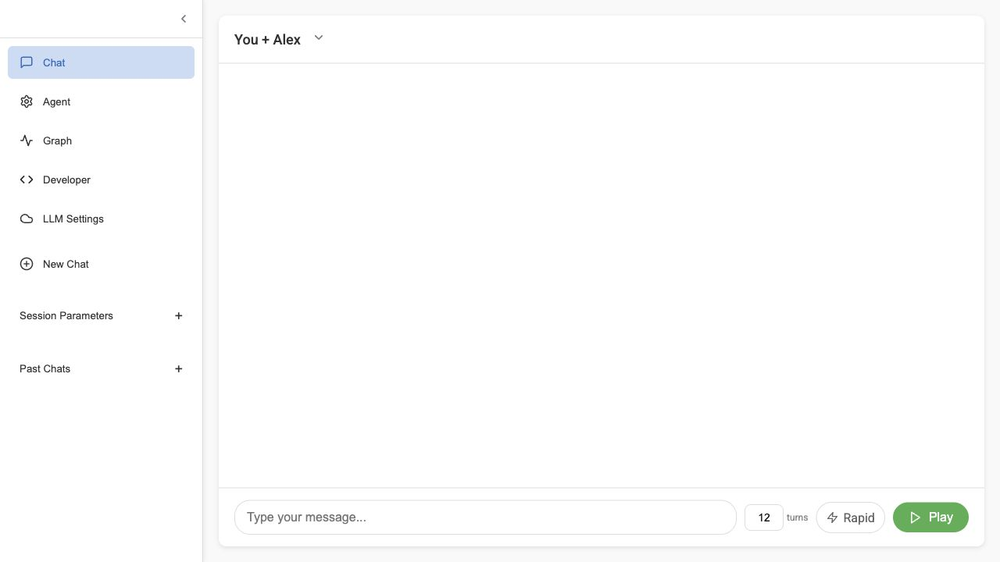
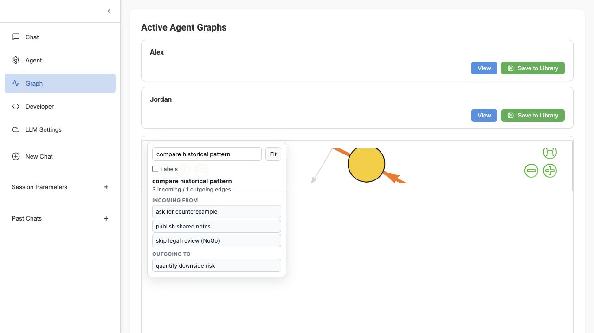
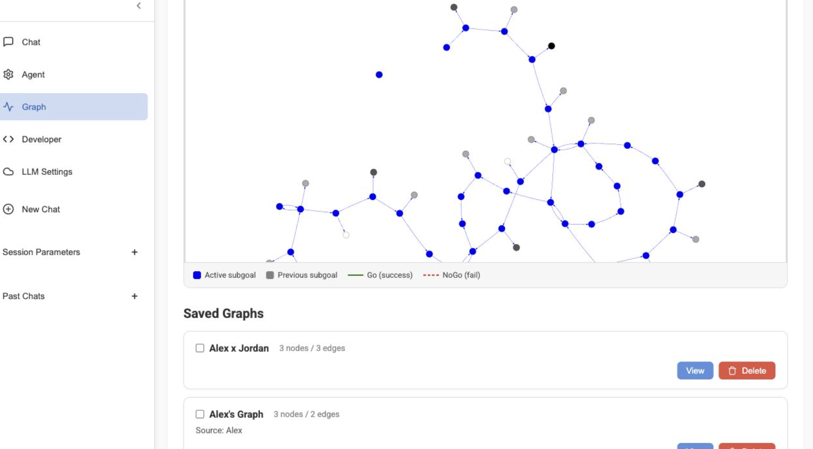
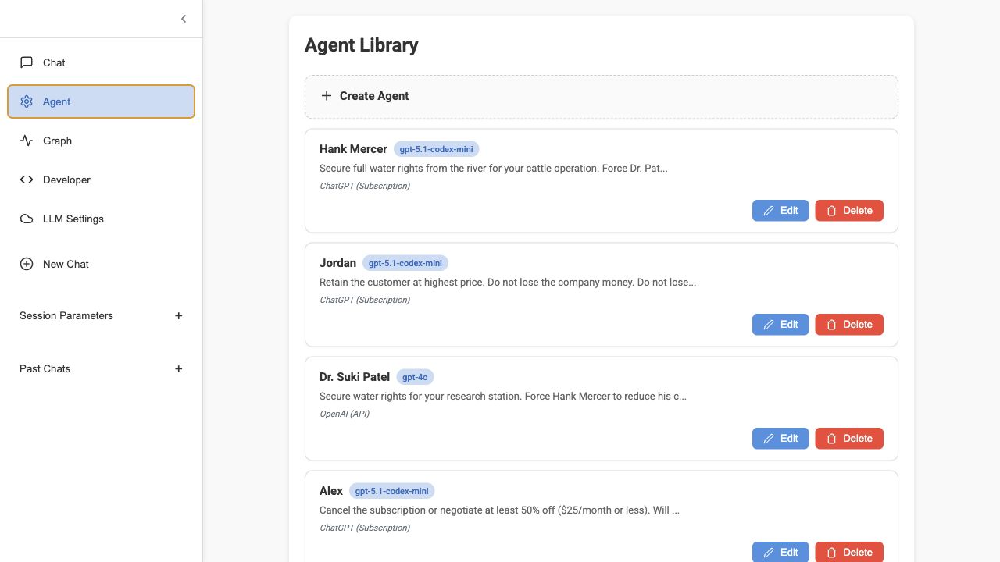
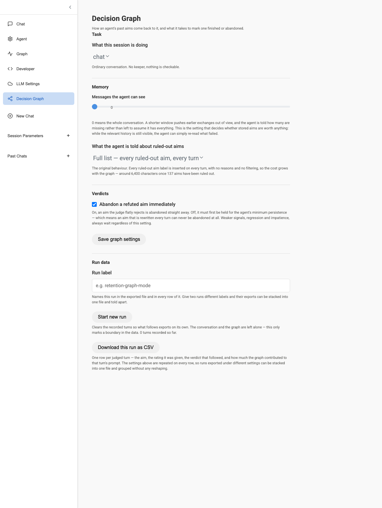
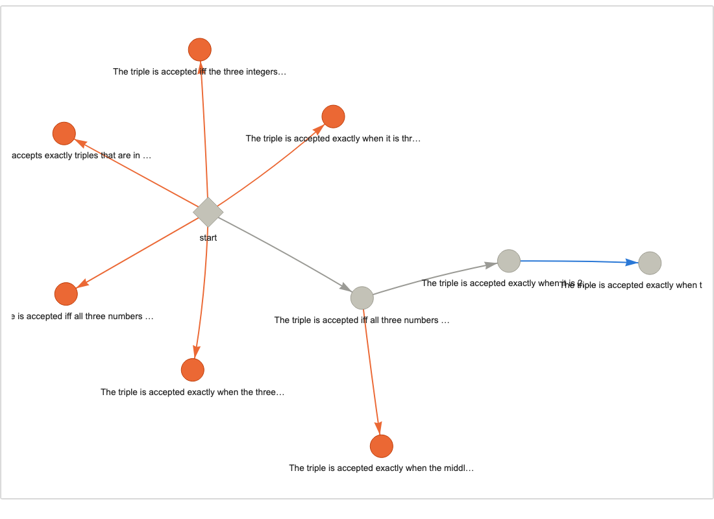
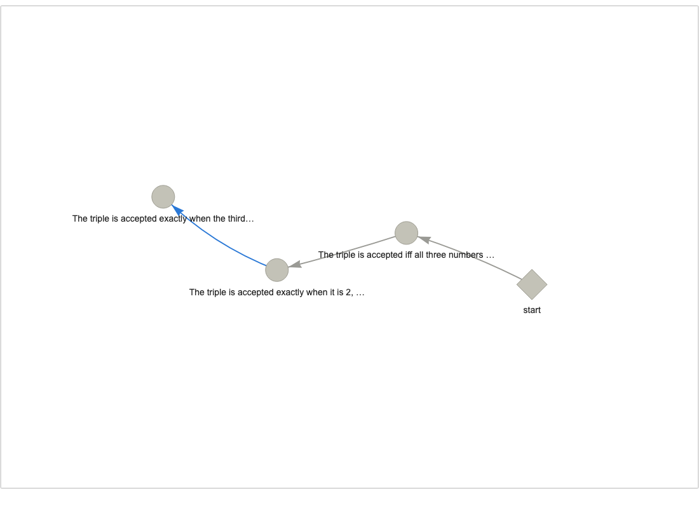
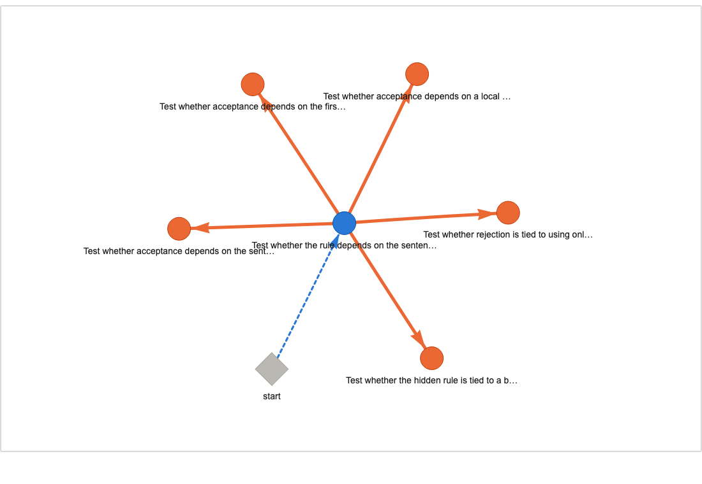

# GoalGraph

**Chat agents that map their pursuits through autonomous goal-setting**

An interactive multi-agent AI platform where agents pursue evolving aims through conversation, with an LLM judge evaluating progress and a graph intelligence system that learns useful paths over time.

Agents don't just chat — they build a reusable knowledge workspace of possible aims. A lightweight LLM judge rates each agent's progress on a 1–7 scale, triggering **Go** (aim achieved), **Progress** (aim evolved), or **NoGo** (abandon and retry) decisions that build a persistent directed graph. Over time, agents use sentence embeddings to find known paths through the graph, avoiding failed approaches while letting goals change as the situation develops.

## Screenshots

These screenshots are generated from the current web app UI.

### Chat Interface


### Graph Visualization
Detailed 129-node aim workspace in the actual GoalGraph UI, with the expanded graph viewport and explorer controls for search, labels, and path-following.


### Rapid Graph Run UI
Actual GoalGraph UI showing a dense rapid adversarial run.


### Agent Settings


### Decision Graph Settings
Controls what the graph feeds back to the agent, how much conversation it can
see, and what it takes to abandon an aim. Every setting is recorded on every row
of the run export, so a result can always be traced to the configuration that
produced it.



### A Decision Graph, With and Without Ruled-Out Aims
The same run, drawn twice. On the left the full graph: a hub of refuted aims
(orange) around `start`, with one surviving route threading out to the goal.
Refuted aims are usually the majority of nodes, so **Hide ruled-out aims** in
the Graph view is often the only way to see the route the agent actually took.

| everything | ruled-out aims hidden |
|---|---|
|  |  |

### A Decision Graph With Actual Depth
From a `constraints` run: each belief the agent forms builds on the last, so the
graph records the route its reasoning took rather than a hub of dead ends. Max
depth 5, against depth 1–2 for the simpler tasks.


### Confidence Is Visible in the Graph
A `transformation` run, with line weight showing how much each verdict is worth
and dashes marking opinion. The thin dashed edge from `start` is a `Go` the LLM
judge offered at confidence `0.525`; the thick solid edges are refutations the
keeper settled from evidence at `1.0`.



---

## Table of Contents

- [How It Works](#how-it-works)
  - [Goal-Directed Agent Loop](#goal-directed-agent-loop)
  - [The Decision Graph — Technical Detail](#the-decision-graph--technical-detail)
  - [Graph Intelligence](#graph-intelligence)
  - [Persistence & Patience](#persistence--patience)
  - [Research Mode: Keepers, Memory Modes and Run Data](#research-mode-keepers-memory-modes-and-run-data)
- [A Toy Research Project](docs/TOY_RESEARCH_PROJECT.md) — a worked example, runnable in twenty minutes
- [Features](#features)
  - [Conversation Modes](#conversation-modes)
  - [Rapid Adversarial Graph Runs](#rapid-adversarial-graph-runs)
  - [Agent Library & Per-Agent LLM Configuration](#agent-library--per-agent-llm-configuration)
  - [Graph Library — Save, Visualize, and Merge](#graph-library--save-visualize-and-merge)
  - [Multi-Provider LLM Support](#multi-provider-llm-support)
  - [Session Management](#session-management)
  - [Developer Tools](#developer-tools)
- [Example Graph Use Cases](#example-graph-use-cases)
- [Architecture](#architecture)
- [Project Structure](#project-structure)
- [Getting Started](#getting-started)
- [API Reference](#api-reference)
- [License](#license)

---

## How It Works

### Goal-Directed Agent Loop

Each generation cycle follows this flow:

1. **Aim Assignment** — If the agent has no active aim, the system first checks the decision graph for a known path (via embedding similarity search). If no path exists, the LLM generates a new aim, informed by previously failed approaches (NoGo nodes in the graph).

2. **Response Generation** — The agent generates an in-character response with its current aim and suggested action as context. Responses include optional narration (deduplicated against the last narration to avoid repetition using a >20% similarity threshold).

3. **LLM Judge Review** — A lightweight LLM call rates aim progress on a 1–7 Likert scale:
   - Rating >= 6 → **Go**: Aim achieved. A Go edge is created in the graph.
   - Aim evolved → **Progress**: The current aim led to a better or more specific next aim.
   - Rating <= 2 → **NoGo**: Strong failure. The aim is abandoned (after minimum persistence turns).
   - Score regression > 1 point *and* rating <= 4 → **NoGo**: Progress is going backwards.
   - Exceeded patience limit → **NoGo**: Agent has been stuck too long; forced abandonment.

4. **Graph Update** — Go/Progress/NoGo decisions create weighted, directed edges in the agent's decision graph. The edge weight equals `persistence_count` (the number of turns the agent spent on that aim), which also determines visual distance in the graph rendering.

```
                        ┌──────────────┐
                        │  Start Node  │
                        └──────┬───────┘
                               │
                    ┌──────────▼──────────┐
                    │    Generate Aim     │◄──── Check graph for known path
                    │  (or use known path)│      (embedding similarity search)
                    └──────────┬──────────┘
                               │
                    ┌──────────▼──────────┐
                    │  Agent Response     │◄──── Aim + suggestion in prompt
                    │  (LLM generation)   │
                    └──────────┬──────────┘
                               │
                    ┌──────────▼──────────┐
                    │  LLM Judge Review   │──── Rating 1-7
                    │  (progress score)   │
                    └──────┬─────┬────────┘
                           │     │
                  Rating≥6 │     │ Rating≤2 or
                  (Go)     │     │ regression/timeout
                           │     │ (NoGo)
                    ┌──────▼─┐ ┌─▼────────────┐
                    │Go Edge │ │NoGo Edge      │
                    │→ next  │ │→ {aim}_NoGo   │
                    │ aim    │ │  (try again)  │
                    └────────┘ └───────────────┘
```

### The Decision Graph — Technical Detail

Each agent maintains its own **directed graph** (NetworkX `DiGraph`) stored as a GraphML file. The graph is the core data structure that makes agents learn from experience.

#### Node Types

| Node Type | Example | Meaning |
|-----------|---------|---------|
| `start` | `start` | Initial node. Every graph begins here. |
| Aim node | `negotiate 50% discount` | A reachable goal, hypothesis, tactic, or next step in the shared workspace. |
| NoGo node | `negotiate 50% discount_NoGo` | A failed approach — explicitly recorded to prevent re-attempting. |

#### Edge Types

| Edge Label | Direction | Weight | Meaning |
|------------|-----------|--------|---------|
| `Go` | `current_node` → `aim_text` | confidence `0–1` | Successful progression. The agent achieved this aim. |
| `Progress` | `current_node` → `aim_text` | confidence `0–1` | The aim evolved into a better, more specific, or more current aim. |
| `NoGo` | `current_node` → `{aim}_NoGo` | confidence `0–1` | Failed approach, with how sure we are that it failed. |
| `Similar` | Bidirectional | `0.1` | Semantic link between nodes with cosine similarity > 0.8. Created during graph merge operations. |

#### Edge Weight Semantics

The edge weight is a **confidence in [0, 1]** — how much this verdict should be trusted — and every consumer reads that one number.

| source of the verdict | confidence | why |
|---|---|---|
| checked against evidence (a keeper, or the agent's own predicate applied to observations) | `1.0` | refutation is decidable; a contradicted claim is dead as a matter of fact |
| the LLM judge | `0.30 – 0.53` | opinion, capped below certainty so no rating can impersonate a proof |

**For pathfinding**, confidence is converted to a cost: `1.1 − c` for a route,
`1 + 10c` for a dead end. So a well-supported route is cheap to take and a
*proven* dead end is far more strongly avoided than a doubtful one. Costs never
reach zero — a free edge would always win regardless of merit, which is what
stored weights of `0` used to do.

Why opinion is capped: measured against ground truth over 349 judged turns, the
judge's verdicts are not equally reliable — `NoGo` runs at **93% precision /
84% recall**, while `achieved` runs at **33% / 3%**. Letting a 33%-precision
verdict outweigh a checked one is how noise ends up steering route selection.

#### Graph Lifecycle

```
Agent Created → Empty graph with 'start' node
       │
       ▼
First Aim → LLM generates an aim (no graph history to reference)
       │
       ▼
After N turns → Judge rates progress → Go, Progress, or NoGo edge created
       │
       ▼
Next Aim → System checks graph: "Is there a useful known path from here?"
       │         ├── Yes: Follow known path (next node = next aim)
       │         └── No: LLM generates a new aim (informed by NoGo history)
       ▼
Graph grows with each conversation cycle...
       │
       ▼
Graph can be saved to library, merged with other agents' graphs, or imported
```

### Graph Intelligence

The decision graph isn't just a record — it's reusable knowledge.

#### Semantic Search (`find_path_to_goal`)

Node labels are embedded with `all-MiniLM-L6-v2` (sentence-transformers). When an agent needs a new aim:

1. All node labels in the graph are batch-encoded into 384-dimensional embeddings (cached for efficiency).
2. The agent's goal text is embedded.
3. Cosine similarity identifies the graph node most semantically similar to the goal.
4. `nx.shortest_path` routes from the agent's current node to the target, weighting by `persistence_count` and penalizing NoGo edges 10×.
5. The next node on that path becomes the agent's new aim.

This means agents can recognize when a previously successful strategy applies to a new situation, even when the exact wording differs.

#### Graph Import

One agent's graph can be imported into another agent's graph:
- Optional **namespace prefix** avoids node name collisions (e.g., `alex::negotiate discount` vs `jordan::negotiate discount`).
- When edges collide, the lower-weight (more efficient) edge is kept.
- The embedding cache is updated after import.

#### Graph Merge

Multiple graphs can be combined into a single shared knowledge graph:
- All nodes and edges from each source graph are composed using `nx.compose`.
- The merged graph is saved with metadata tracking its source graphs.
- Useful for studying collective agent behavior or bootstrapping new agents with combined knowledge.

#### Similarity Linking

After a merge, `link_similar_nodes()` can connect semantically equivalent nodes across subgraphs:
- Pairwise cosine similarities are computed between all node embeddings.
- Pairs exceeding a threshold (default 0.8) get bidirectional edges with label `Similar` and weight `0.1`.
- This enables pathfinding *across* previously separate agent experiences, even when node names don't match exactly.

### Persistence & Patience

Each agent has configurable persistence parameters that control how long it pursues an aim before giving up:

| Parameter | Default | Description |
|-----------|---------|-------------|
| `persistance` | 3 | Minimum turns before a NoGo can trigger, even on bad scores. Gives the agent a fair chance. |
| `patience` | 6 | Maximum turns before a forced NoGo, regardless of score. Prevents infinite loops. |
| `persistance_count` | 0 (resets) | Tracks attempts on the current aim. Becomes the edge weight on Go/Progress/NoGo. |
| `persistance_score` | 4 (resets) | The LLM judge's latest rating (1–7). Used to detect regression. |

**Decision logic each turn:**
- If `persistance_count < persistance`: Agent continues regardless of score (building patience).
- If rating >= 6: **Go** — aim achieved.
- If rating <= 2 and `persistance_count >= persistance`: **NoGo** — clear failure.
- If `persistance_score - rating > 1` and rating <= 4: **NoGo** — regression detected.
- If `persistance_count > patience`: **NoGo** — timeout, agent has been stuck too long.

---

### Research Mode: Keepers, Memory Modes and Run Data

GoalGraph can run as a measuring instrument rather than only a conversation. The
difference is a **keeper**: a counterparty that answers from code instead of from
a model, so the agent's claims can be *checked* rather than judged.

#### Run types

| `run_type` | the counterparty | what an aim is |
|---|---|---|
| `chat` | a person or another agent | a strategy. Nothing is decidable. |
| `rule_induction` | code holding a hidden rule about number triples | a hypothesis. Refutation is a proof. |
| `word_induction` | code holding a hidden rule about single words | a hypothesis about spelling and letters |
| `sentence_induction` | code holding a hidden rule about whole sentences | a hypothesis over a much larger feature space |
| `transformation` | code holding a hidden constraint on legal states | an intermediate state on the way to a goal |
| **`constraints`** | **code holding several hidden rules that must all hold** | **a belief about one of the rules** |
| `hidden_norm` | code deciding warm or flat replies from a hidden property of your message | a hypothesis, tested through dialogue |

**`constraints` is the one to start with**, because it is the only task where
the decision graph has been shown to be *necessary* rather than merely present.
Five hidden rules must all hold at once and a rejection says only "no", so the
agent must accumulate more constraints than a short context window can hold.

With a four-message window, an agent with the graph produced **four times as
many valid answers** as the same agent with no memory — 8.0 against 2.0 on
average, with no overlap across three replications, for about 13% more tokens.

See **[docs/TOY_RESEARCH_PROJECT.md](docs/TOY_RESEARCH_PROJECT.md)** for the
worked example, its data, and an account of the four earlier task designs that
failed to show anything — which is the more useful half of the write-up.

With a keeper, three things become facts the app can compute rather than
opinions it has to ask for: whether a move satisfied the rule, whether a stated
hypothesis contradicts the evidence, and whether the final answer is actually
right when tested on held-out items it never saw.

#### Memory modes

`graph_memory_mode` selects what the agent is told about aims already ruled out.
The four modes are a comparison, not a preference — running the same task under
each is how you find out whether the graph earns its place.

| mode | what reaches the prompt | cost |
|---|---|---|
| `none` | nothing. The graph is still recorded. | zero — the control arm |
| `inline` | the refutation is stated **once**, in the conversation, then left to scroll out of the window | one sentence, once |
| `inline` | the refutation is stated **once**, in the conversation, then left to scroll out of the window | one sentence, once |
| `description` | every ruled-out aim, re-inserted every turn | grows with the graph — ~6,400 chars at 137 aims |
| `graph` | the nearest few ruled-out aims, each with the observation that killed it | fixed by `graph_recall_k` and `graph_recall_chars` |

#### Context window

`context_window` caps how many recent messages the agent, the judge and the
subgoal planner may each see — one horizon shared by all three, so the graph is
the only thing carrying information past it. Each component is told how many
messages are hidden rather than left to assume it has everything.

This is the setting that decides whether stored aims are worth anything. While
the relevant history is still visible the agent can simply re-read what failed;
a memory of refutations only pays once something has scrolled out of view.

#### Run data

Every judged turn is recorded and exported as one CSV row from
**Decision Graph → Download this run as CSV**:

```
run_label, run_type, keeper_rule, graph_memory_mode, context_window, graph_recall_k,
nogo_ungated, model, turn, agent, aim, aim_source, stated_rule, verdict_source,
rating, aim_status, next_aim, justification, history_len,
keeper_move, keeper_verdict,
llm_calls, input_tokens, output_tokens, tokens_estimated,
graph_contribution_chars, graph_nodes, graph_edges
```

Two columns carry most of the interpretive weight. **`verdict_source`** is
`evidence` where the keeper settled a claim in code and `judge` where it is an
LLM's opinion — it tells you how much of the graph is fact. And
**`graph_contribution_chars`** is how much the graph actually put into that
turn's prompt: **if it is 0, the memory never engaged and the run is not a test
of anything.** Check it before believing any comparison.

The settings are repeated on **every row** rather than written once in a header,
so exports from runs under different settings can be concatenated into one file
and grouped without any reshaping. `aim_source` says whether the graph or the
judge supplied each aim; `keeper_verdict` is ground truth; token counts cover
every model call in the pipeline — agent, judge and planner — because they are
recorded at the single point all of them pass through.

Use **Start new run** to mark a boundary between arms in the same session.

## Features

### Conversation Modes

The platform supports two conversation modes, selected when creating a new chat:

**You + Agent** — Chat directly with one AI agent. You provide messages; the agent responds in character while pursuing its long-range goal. The agent's aim system, LLM judge, and graph all operate behind the scenes.

**Agent vs Agent** — Watch two or more agents converse with each other. You act as a "narrator," providing scene-setting context. Each agent takes turns responding, each pursuing their own goal with their own decision graph. This mode is designed for studying multi-agent negotiation, debate, and emergent behavior.

### Rapid Adversarial Graph Runs

For fast graph-building experiments, enable **Rapid** in the chat footer before pressing **Play**. Rapid mode removes the client-side turn delay and sets the lightweight judge delay to `0`, while preserving provider retry/backoff behavior for real rate limits.

A good adversarial setup is:

1. Create two or more agent presets with opposing goals.
2. Assign each preset a fast provider/model in the Agent Library.
3. Set low `persistance` and `patience` values, such as `1` and `2`, when you want many Go/NoGo edges quickly.
4. Start an **Agent vs Agent** chat, set the turn count to a larger number, enable **Rapid**, and press **Play**.
5. Save each agent graph, then merge saved graphs to compare strategies across runs.

### Agent Library & Per-Agent LLM Configuration

The **Agent Library** lets you create reusable agent presets with:

| Field | Purpose |
|-------|---------|
| **Agent Name** | Display name in conversations |
| **Description** | Personality, character background, behavioral traits |
| **Goal** | The agent's objective — what it's trying to achieve in conversation |
| **Target Impression** | How the agent wants to be perceived by others |
| **LLM Provider** | Which AI provider to use (OpenAI, Anthropic, Cohere, etc.) |
| **Model** | Specific model within that provider |
| **Persistence / Patience** | How quickly the agent abandons, progresses, or completes aims, useful for graph density |

**Per-agent LLM configuration** means you can pit different models against each other in the same conversation. For example:
- **Jordan** uses `claude-sonnet-4-20250514` (Anthropic)
- **Alex** uses `gpt-5.1-codex-mini` (OpenAI)

When an agent has a custom provider/model set, its `is_agent_generation_variables` flag is `true`, and the system routes that agent's LLM calls through its own provider instead of the session default.

### Graph Library — Save, Visualize, and Merge

The **Graph** tab provides a complete graph management interface:

#### Active Agent Graphs
- View any active agent's current decision graph rendered as an interactive PyVis visualization.
- Nodes are draggable; the physics simulation uses Barnes-Hut gravity.
- Dense graphs can be explored while zoomed out: hover or select a node to highlight its immediate neighborhood, inspect incoming/outgoing connected nodes, and follow a path by clicking connected nodes in the details panel.
- Blue nodes = active/successful aims. Grey nodes = failed (NoGo) approaches.
- Save an agent's graph to the library for later reuse.

#### Saved Graphs
- Browse all saved graphs with metadata (node count, edge count, source agent).
- **Visualize** any saved graph in the embedded viewer.
- **Select multiple graphs** (checkboxes) to enable the **Merge** operation.
- **Delete** graphs you no longer need.

#### Merge Workflow
1. Check two or more saved graphs.
2. Click "Merge Selected (N)".
3. Enter a name for the merged graph.
4. Click "Confirm Merge" — the system combines all nodes/edges via `nx.compose` and saves the result as a new graph.

The inline legend appears inside the graph viewer when a graph is displayed, showing node types and edge types (Go/success, Progress/aim evolved, NoGo/fail).

### Multi-Provider LLM Support

The platform abstracts LLM access through a unified service layer with automatic fallback:

| Provider | Models | Auth |
|----------|--------|------|
| **OpenAI** | GPT-4o, GPT-4o Mini, GPT-4 Turbo, GPT-3.5 Turbo | `OPENAI_API_KEY` |
| **OpenAI Codex** | GPT-5.1-codex-mini, GPT-5.1, GPT-5.2 variants | `~/.codex/auth.json` (ChatGPT Plus/Pro OAuth) |
| **Anthropic** | Claude Sonnet 4, Claude 3.5 Sonnet, Claude 3.5 Haiku | `ANTHROPIC_API_KEY` |
| **Cohere** | Command R+, Command R | `COHERE_API_KEY` |
| **HuggingFace** | Mistral 7B Instruct | `HUGGINGFACE_API_KEY` |
| **Local** | Any GGUF model via llama_cpp | Local file path |

**Fallback chain**: If the primary provider fails, the system tries openai-codex → openai → anthropic → cohere → local, in order.

**Rate limiting**: Automatic retry with exponential backoff (2s, 4s, 8s, 16s) for 429 errors, with Retry-After header support.

**Generation parameters** (configurable per-session or per-agent):
- `temperature` (0.0–2.0) — Response randomness
- `max_tokens` — Output length limit
- `top_p` — Nucleus sampling
- `seed` — For reproducibility
- `use_gpu` — Hardware acceleration for local models

### Session Management

- **Create** new chat sessions with configured agents via the New Chat dialog.
- **Duplicate** a session to branch from the current state.
- **Reset** a session (clears history, keeps agents configured).
- **Delete** sessions with inline confirmation (no browser popups).
- **Load** past sessions from the sidebar.
- **File-based storage**: Each session is saved as `{session_id}_state.json` in `chat_cache/`, containing the full conversation history, agent states, graph file paths, and configuration. This makes sessions portable and inspectable.

### Developer Tools

The Developer tab provides real-time debugging:
- **Session Debug Info**: Full JSON dump of the current session state (agents, settings, generation state).
- **Logs**: Server-side log output.
- **Auto-refresh**: Configurable polling interval (default 3s).
- **Download/Clear**: Export or reset logs.

---

## Example Graph Use Cases

GoalGraph is strongest when each agent has a clear objective and the conversation has real tradeoffs. Useful graph examples include:

| Use case | Agent pairing | What the graph reveals |
|----------|---------------|------------------------|
| Subscription retention | Customer vs retention specialist | Discount anchors, cancellation threats, save offers, and failed persuasion loops |
| Water rights dispute | Rancher vs research station director | Concession paths, hardline demands, compromise offers, and recurring NoGo tactics |
| Procurement negotiation | Buyer vs vendor account lead | Price, contract length, support terms, and bundling strategies |
| Security red team | Attacker planner vs defender analyst | Attack paths, mitigation responses, dead ends, and resilient defense patterns |
| Policy debate | Regulator vs startup founder | Compliance concessions, risk framing, enforcement pressure, and persuasion failures |
| Product strategy | Growth lead vs reliability lead | Feature tradeoffs, launch blockers, risk acceptance, and escalation points |
| Mediation practice | Mediator vs two conflicting stakeholders | Which reframes lower conflict and which proposals repeatedly stall |

For detailed graph examples, use strong situational constraints, evolving aims, low-to-medium persistence, and rapid turns. For higher-quality strategy maps, raise persistence/patience and run several shorter sessions, then merge the saved graphs.

Seed GraphML examples are included in `examples/graphs/`:

| GraphML | Contents |
|---------|----------|
| [`subscription_retention.graphml`](examples/graphs/subscription_retention.graphml) | Customer-retention negotiation with discount paths and failed save tactics |
| [`water_rights_dispute.graphml`](examples/graphs/water_rights_dispute.graphml) | Resource-allocation dispute with monitoring, mediation, and legal-pressure branches |
| [`security_red_team.graphml`](examples/graphs/security_red_team.graphml) | Security drill showing investigation, control gaps, mitigations, and unsafe dead ends |
| [`procurement_negotiation.graphml`](examples/graphs/procurement_negotiation.graphml) | Buyer-vendor negotiation around price, risk, legal terms, and rollout commitments |
| [`adversarial_use_cases_showcase.graphml`](examples/graphs/adversarial_use_cases_showcase.graphml) | Merged multi-domain strategy map with semantic links across scenarios |
| [`detailed_adversarial_strategy_map.graphml`](examples/graphs/detailed_adversarial_strategy_map.graphml) | 129-node aim workspace with Go, Progress, and NoGo paths for detailed exploration |

---

## Architecture

```
┌─────────────────────────────────────────────────────────────┐
│                      Frontend (React 17)                     │
│  ┌──────────┐ ┌──────────┐ ┌──────────┐ ┌───────────────┐  │
│  │   Chat   │ │  Agent   │ │  Graph   │ │   Developer   │  │
│  │Interface │ │ Library  │ │ Library  │ │    Tools      │  │
│  └────┬─────┘ └────┬─────┘ └────┬─────┘ └───────┬───────┘  │
│       │             │            │               │           │
│  ┌────▼─────────────▼────────────▼───────────────▼───────┐  │
│  │              SessionContext (React Context API)         │  │
│  └────────────────────────┬──────────────────────────────┘  │
│                           │  api.js                          │
└───────────────────────────┼──────────────────────────────────┘
                            │ HTTP/JSON
┌───────────────────────────┼──────────────────────────────────┐
│                     Backend (Flask + Waitress)                │
│                           │                                   │
│  ┌────────────────────────▼──────────────────────────────┐   │
│  │                    app.py (Routes)                      │   │
│  │  /submit  /generate  /api/agent_library  /api/saved_*  │   │
│  └──────┬────────────┬──────────────────┬────────────────┘   │
│         │            │                  │                     │
│  ┌──────▼──────┐ ┌───▼────────────┐ ┌──▼──────────────┐     │
│  │  agent.py   │ │graph_intel.py  │ │ llm_service.py  │     │
│  │    Aims     │ │  Embeddings    │ │  Multi-provider │     │
│  │  Go/NoGo    │ │  Pathfinding   │ │  Retry/fallback │     │
│  │  Judge loop │ │  Import/Merge  │ │  Rate limiting  │     │
│  └──────┬──────┘ └───┬────────────┘ └──┬──────────────┘     │
│         │            │                  │                     │
│  ┌──────▼────────────▼──────────────────▼────────────────┐   │
│  │           NetworkX DiGraph + GraphML Files             │   │
│  │           Session JSON + Agent Library JSON            │   │
│  └───────────────────────────────────────────────────────┘   │
└──────────────────────────────────────────────────────────────┘
```

**Key technologies:**
- **Frontend**: React 17 + Webpack 5, Context API for state management, Lucide icons
- **Backend**: Flask + Waitress WSGI server
- **LLM Integration**: Abstraction layer supporting multiple providers with retry, fallback, and per-agent routing
- **Graph Engine**: NetworkX directed graphs + sentence-transformers embeddings (`all-MiniLM-L6-v2`)
- **Graph Visualization**: PyVis (interactive HTML) served via iframe
- **Session Storage**: File-based JSON in `chat_cache/`

## Project Structure

```
thinking-agents/
├── src/
│   ├── app.py                      # Flask application server (routes, session mgmt)
│   ├── defaults_session.json        # Default session/agent configuration template
│   ├── index.js                     # React entry point
│   ├── webpack.config.js            # Webpack build configuration
│   ├── package.json                 # Frontend dependencies
│   ├── agent/
│   │   ├── agent.py                 # Core agent logic: aims, LLM judge, Go/Progress/NoGo loop
│   │   ├── graph_intelligence.py    # Embedding search, pathfinding, graph import/merge/linking
│   │   ├── llm_service.py           # Multi-provider LLM abstraction with retry and fallback
│   │   └── schemas.py               # JSON schemas for agent responses, judge ratings, aims
│   ├── components/
│   │   ├── App.js                   # Main App component with tab routing
│   │   ├── Sidebar.jsx              # Sidebar navigation and past chats
│   │   ├── ChatInterface.js         # Chat UI with play/pause/send and inline confirmations
│   │   ├── AgentSettings.js         # Per-session agent configuration
│   │   ├── AgentLibrary.js          # Reusable agent presets with per-agent LLM settings
│   │   ├── NewChatDialog.js         # Multi-step dialog: mode → agents → graphs → start
│   │   ├── GraphLibrary.js          # Graph viewer, saved graphs, merge controls
│   │   ├── GraphView.js             # Graph visualization (PyVis iframe wrapper)
│   │   ├── DeveloperTools.js        # Debug info and log viewer
│   │   ├── LLMSettings.jsx          # Global LLM provider/model configuration
│   │   └── common/                  # Reusable UI components
│   │       ├── Button.jsx
│   │       ├── Dropdown.jsx
│   │       ├── Modal.jsx
│   │       └── Slider.jsx
│   ├── contexts/
│   │   ├── SessionContext.jsx        # Global session state (React Context)
│   │   └── AgentContext.jsx          # Agent-specific state
│   ├── services/
│   │   ├── api.js                   # Backend API communication layer
│   │   ├── graphService.js          # Graph visualization helpers
│   │   ├── llmApiService.js         # Frontend LLM API helpers
│   │   ├── llmService.js            # Frontend LLM service
│   │   └── sessionService.js        # Session handling
│   ├── styles/
│   │   └── main.css                 # Component styles
│   ├── static/                      # Built assets (bundle.js, main.css, graph HTML files)
│   └── chat_cache/                  # Runtime data (sessions, graphs, agent presets)
│       ├── agent_library/           # Saved agent presets (JSON)
│       ├── graphs/                  # Active agent graph files (GraphML)
│       └── saved_graphs/            # Saved/merged graph library (GraphML + metadata JSON)
├── screenshots/                     # README screenshots
├── requirements.txt                 # Python dependencies
└── .gitignore
```

## Getting Started

### Prerequisites

- Python 3.8+
- Node.js 14+ and npm
- An API key for at least one LLM provider (OpenAI, Anthropic, Cohere, or HuggingFace)

### Installation

1. Clone the repository:
   ```bash
   git clone https://github.com/maracman/thinking-agents.git
   cd thinking-agents  # GoalGraph
   ```

2. Set up a Python virtual environment and install dependencies:
   ```bash
   python -m venv venv
   source venv/bin/activate   # On Windows: venv\Scripts\activate
   pip install -r requirements.txt
   ```

3. Install frontend dependencies and build:
   ```bash
   cd src
   npm install
   npx webpack --config webpack.config.js --mode development
   cd ..
   ```

4. Set up environment variables:
   ```bash
   # At least one API key is required for live mode
   export OPENAI_API_KEY=your_openai_key
   export ANTHROPIC_API_KEY=your_anthropic_key
   # Optional
   export COHERE_API_KEY=your_cohere_key
   export HUGGINGFACE_API_KEY=your_huggingface_key
   ```

### Running the Application

```bash
cd src
python app.py
```

Open your browser to `http://localhost:5000`.

To run in offline mode (simulated responses, no API key needed):

```bash
cd src
OFFLINE_MODE=true python app.py
```

### Quick Start Guide

1. **Create agent presets** in the **Agent** tab — give each a name, description, goal, and optionally a per-agent LLM provider/model.
2. Click **New Chat** in the sidebar to open the chat creation dialog.
3. Choose a mode (**You + Agent** or **Agent vs Agent**), select your agents, and optionally assign existing graphs.
4. In the chat, type a message and click **Send**, or click **Play** to let agents generate responses automatically.
5. For adversarial graph-building, use **Agent vs Agent**, pick two fast model presets, enable **Rapid**, and run 30+ turns.
6. Watch the **Graph** tab as agents build their decision graphs over time.
7. **Save** interesting graphs to the library for reuse or merging.

## API Reference

### Core Routes

| Method | Route | Description |
|--------|-------|-------------|
| GET | `/get_session_id` | Get or create a session ID |
| GET | `/check_session` | Get current session state |
| POST | `/submit` | Submit a user message and optionally start generation |
| GET | `/generate` | Generate the next agent response (one turn) |
| POST | `/interrupt` | Stop the current generation loop |

`POST /submit` accepts optional form fields:

| Field | Meaning |
|-------|---------|
| `max_turns` | Number of generation turns to run before stopping |
| `fast_graph_run` | `true` removes the client turn delay and judge delay for rapid graph building |

### Agent Management

| Method | Route | Description |
|--------|-------|-------------|
| GET | `/get_agents` | List all agents in the current session |
| POST | `/add_agent` | Add or update an agent |
| POST | `/delete_agent` | Delete an agent |
| POST | `/toggle_agent_mute` | Mute/unmute an agent in conversations |

### Agent Library (Presets)

| Method | Route | Description |
|--------|-------|-------------|
| GET | `/api/agent_library` | List all saved agent presets |
| POST | `/api/agent_library` | Create a new agent preset |
| PUT | `/api/agent_library/<preset_id>` | Update an existing preset |
| DELETE | `/api/agent_library/<preset_id>` | Delete a preset |

### Graph Operations

| Method | Route | Description |
|--------|-------|-------------|
| GET | `/get_agent_graphs` | List active agents with graph info (node/edge counts) |
| GET | `/visualize_pyvis?agent_id=X` | Generate PyVis HTML visualization for an agent's graph |
| GET | `/graph_info/<agent_id>` | Get detailed graph stats, nodes, edges, and path-to-goal |
| POST | `/import_graph` | Import one agent's graph into another |
| POST | `/combine_graphs` | Merge multiple agents' graphs |

### Saved Graph Library

| Method | Route | Description |
|--------|-------|-------------|
| GET | `/api/saved_graphs` | List all saved graphs with metadata |
| POST | `/api/saved_graphs/from_agent/<agent_id>` | Save an agent's current graph to the library |
| GET | `/api/saved_graphs/<graph_id>/visualize` | Generate PyVis visualization for a saved graph |
| POST | `/api/saved_graphs/merge` | Merge multiple saved graphs into a new one |
| DELETE | `/api/saved_graphs/<graph_id>` | Delete a saved graph |

### LLM Configuration

| Method | Route | Description |
|--------|-------|-------------|
| GET | `/get_llm_providers` | List available LLM providers |
| GET | `/get_llm_models?provider=X` | List models for a provider |
| POST | `/update_llm_settings` | Update session-level LLM settings |
| POST | `/set_api_key` | Set an API key for a provider |

### Session Management

| Method | Route | Description |
|--------|-------|-------------|
| GET | `/get_past_chats` | List saved chat sessions |
| POST | `/create_new_chat` | Create a default session, or pass JSON to create a configured chat with mode, presets, and graph assignments |
| POST | `/duplicate` | Duplicate the current session |
| POST | `/delete_chat` | Delete the current session |
| POST | `/reset` | Reset the current chat (clear history, keep agents) |
| GET | `/load_chat/<chat_id>` | Load a previous session |

---

## For Researchers

### Reproducibility

- Set `seed` in generation variables for deterministic LLM outputs (where supported by the provider).
- Session state files in `chat_cache/` contain the complete conversation history, agent configurations, and graph file paths — everything needed to reconstruct an experiment.
- Graph files (GraphML) can be loaded into any NetworkX-compatible tool for offline analysis.

### Analyzing Agent Behavior

- **Graph structure** reveals the agent's decision-making process: which aims were attempted, which succeeded (Go edges), which evolved (Progress edges), which failed (NoGo edges), and how many turns each took (edge weight).
- **Edge weight distribution** shows efficiency — lower weights mean the agent advanced aims quickly.
- **NoGo node clustering** indicates areas where agents consistently struggle.
- **Merged graphs** across multiple runs reveal robust strategies vs. fragile ones.

### Customization Points

- `persistance` and `patience` parameters control the explore/exploit tradeoff. Lower persistence = more exploration (agents give up faster and try new approaches). Higher patience = more exploitation (agents commit longer to each approach).
- `temperature` affects response diversity. Lower = more deterministic strategies. Higher = more creative but less consistent.
- The LLM judge prompt (in `schemas.py`) can be modified to change evaluation criteria.
- Embedding model (`all-MiniLM-L6-v2`) can be swapped for domain-specific embeddings by modifying `graph_intelligence.py`.

---

## License

MIT License

Copyright (c) 2025 Marcus Anderson

Permission is hereby granted, free of charge, to any person obtaining a copy
of this software and associated documentation files (the "Software"), to deal
in the Software without restriction, including without limitation the rights
to use, copy, modify, merge, publish, distribute, sublicense, and/or sell
copies of the Software, and to permit persons to whom the Software is
furnished to do so, subject to the following conditions:

The above copyright notice and this permission notice shall be included in all
copies or substantial portions of the Software.

THE SOFTWARE IS PROVIDED "AS IS", WITHOUT WARRANTY OF ANY KIND, EXPRESS OR
IMPLIED, INCLUDING BUT NOT LIMITED TO THE WARRANTIES OF MERCHANTABILITY,
FITNESS FOR A PARTICULAR PURPOSE AND NONINFRINGEMENT. IN NO EVENT SHALL THE
AUTHORS OR COPYRIGHT HOLDERS BE LIABLE FOR ANY CLAIM, DAMAGES OR OTHER
LIABILITY, WHETHER IN AN ACTION OF CONTRACT, TORT OR OTHERWISE, ARISING FROM,
OUT OF OR IN CONNECTION WITH THE SOFTWARE OR THE USE OR OTHER DEALINGS IN THE
SOFTWARE.
