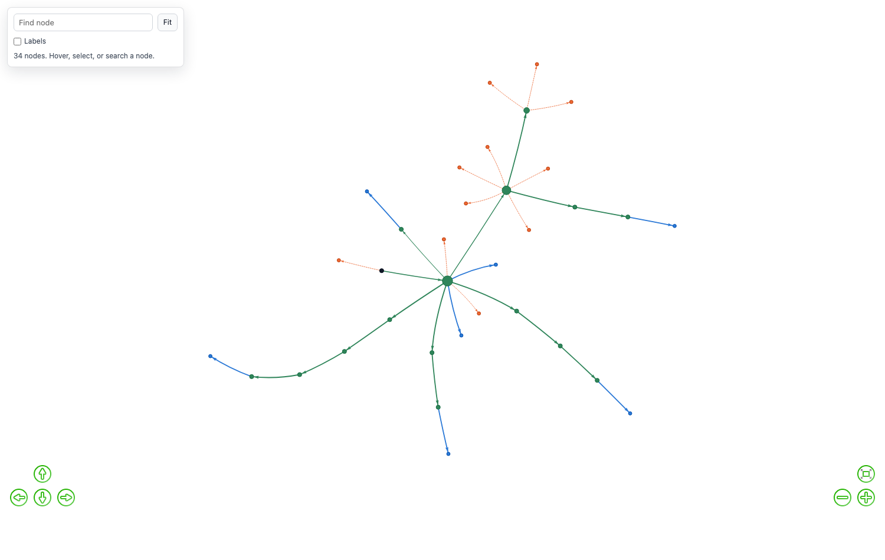
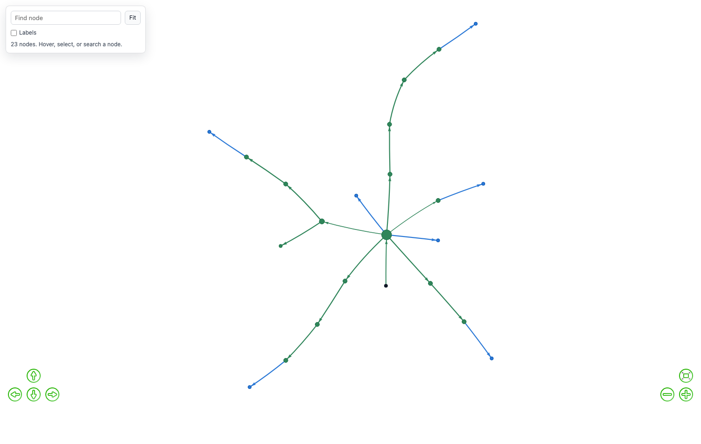
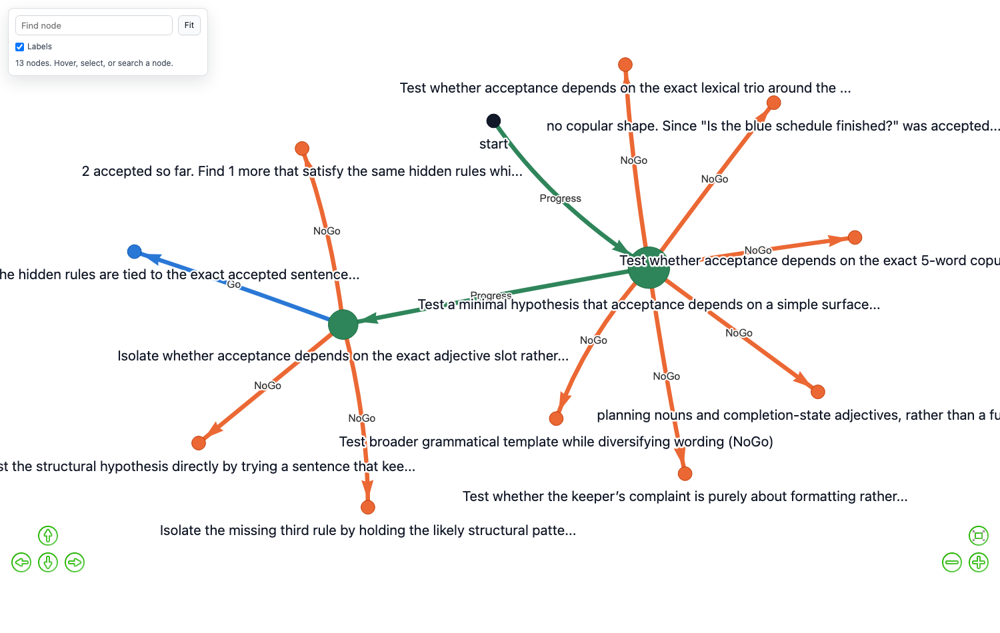
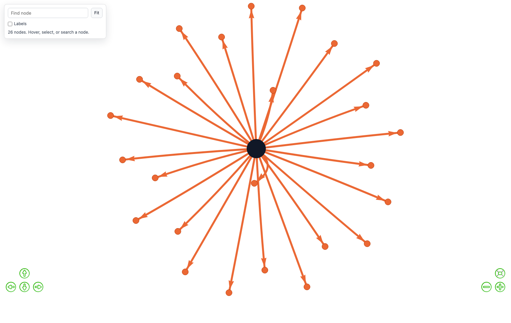

# Development notes

Working notes from building the example in
[WALKTHROUGH.md](WALKTHROUGH.md): the task designs that did
not work, a regression that took a while to spot, and four occasions where the
measuring tools produced a number that looked like a finding.

Kept because the failures are more instructive than the result, and because
anyone extending the run types will hit the same edges. It is a lab notebook,
not a paper - the worked example is next door.

---

## The question

An agent pursuing a goal in an environment it does not fully understand forms
beliefs about that environment, and some are wrong. GoalGraph records each
belief as an **aim** and each verdict on it as a **Go / Progress / NoGo** edge.

Two questions follow, and they are not the same question:

> **Does the graph carry what a short context window drops?**
> **Is the graph worth handing to the next problem?**

The first is about memory within a run. The second is about reuse across runs,
and it is the one that decides whether a decision graph is an asset or a log.

**Short answers.** Within a run, on the first task tried, no — the effect is
inside noise and the graph is not cheaper. Across runs, on a task with real
structure, yes — measurably, but unevenly, and in two cases it made things
worse.

---

## The task that works: a clinic

**Run type: `clinic`.** Two agents. A clinician narrows seven disorders and
commits to a diagnosis; a patient answers what is asked and not much more.

This is a puzzle, not a clinical instrument. It borrows the *shape* of
criteria-based diagnosis because that shape makes a good game. No diagnostic
text is reproduced from any manual, the conditions are simplified past the
point of clinical use, and nothing here describes real illness.

```
7 disorders   each needing N of M features, with exclusions
20 features   what can be asked about
45 patients   distinct presentations generated from the criteria
```

Five properties, each added because the task did not work without it.

**Criteria, not symptom sets.** A disorder needs a threshold of features rather
than an exact match, so no single answer settles anything. Candidates are those
whose criteria are still *satisfiable*. An earlier version compared against a
stored case, which made any feature unique to one disorder an instant giveaway
and collapsed seven candidates to one on a single reply.

**The complaint is a consequence, not a symptom.** Patients open outside the
diagnostic vocabulary — *"I got a written warning at work last week"*, *"I had
to have my wedding ring cut off"*, *"I fell asleep on the train and went four
stops past my stop"*. The clinician has to work backwards. Opening with "I feel
low" would hand over a criterion for free.

**Facts the patient will not give up.** Asked outright about what they are
ashamed of, the patient deflects and nothing is learned — a genuinely blocked
route. But each guarded feature has ordinary correlates they will discuss, so
it can be established indirectly. A decoy disorder shares everything with the
drinking case *except* those correlates, so the detour is not a shortcut but
the only route: the questions that establish the hidden fact are exactly the
ones that separate the two.

**Two kinds of red herring, because they fail differently.**

| kind | example | how it is disproved |
|---|---|---|
| situational | early waking, caused by building work next door since March | ask when it started; it then stops counting |
| incidental | the drinker really does check things and avoid routes | never disproved — the line simply cannot complete |

The situational kind can make a clinician *wrong*: it counts toward the
criteria until someone asks what changed, and then the evidence base shrinks.
The incidental kind is harder — real symptoms that cohere into nothing, which
the clinician has to abandon on its own judgement rather than because it was
told.

**Every case is winnable.** Where a *required* feature is guarded, it can only
be reached through correlates, so a presentation lacking a complete correlate
set cannot be diagnosed however well the clinician reasons. `diagnosable()`
filters those out. Two of twelve patients in the first long run were impossible
for this reason and read as agent failures — see
[Mistakes in the measurement](#mistakes-in-the-measurement).

---

## What makes a verdict trustworthy

The keeper is deterministic code holding the hidden answer. On single-agent
tasks it answers the agent directly. On `clinic` it does not speak at all — the
patient is a second agent, so the counterparty is already at the table and the
keeper only scores the transcript.

What it settles, it settles in code:

| verdict | fires when | source |
|---|---|---|
| `Progress` | a diagnostic criterion is pinned down | evidence |
| `NoGo` | a question re-treads settled ground, is deflected, or exposes a red herring that removes a criterion | evidence |
| `Go` | the clinician names the right disorder | evidence |

**Progress is a criterion pinned down, not a candidate eliminated.** This is
what makes the graphs deep. Narrowing the field happens two or three times in
an interview; establishing a criterion happens a dozen times. Scoring the
former gave graphs two hops deep for a twenty-turn conversation.

An LLM judge still rates aims and proposes the next one, but on a keeper task
it cannot grant a positive verdict the keeper does not support. Evidence
outranks opinion in **both** directions — see
[The regression](#the-regression-and-why-it-matters).

---

## The result

Sixteen patients seen in sequence by one clinician, each a fresh session, with
the clinician's graph saved after each patient and loaded into the next.
Consecutive patients rarely share a diagnosis, and repeat disorders are
different presentations — so a graph that memorised an answer will be wrong.

**13 of 16 diagnosed.**

The honest measure of reuse is within a disorder: the same answer, a different
patient, later in the sequence.

| disorder | turns, first presentation → later |
|---|---|
| generalised anxiety | 57 → **7** |
| panic with avoidance | 23 → **9** |
| obsessive checking | 17 → **9** |
| burnout exhaustion | failed at 70 → **35** |
| depressive episode | 25 → 21 → 27 |
| thyroid disturbance | 9 → **25** |
| alcohol-related low mood | 39 → **failed → failed** |

**Four improved, one flat, two got worse.** Aggregated, patients 1–8 solved 6/8
at a mean of 28.3 turns; patients 9–16 solved 7/8 at 19.0. The effect is real
and it is not uniform, and the two regressions are more interesting than the
average.

**The alcohol case is the informative failure.** It is the hardest by
construction — its required feature is guarded, reachable only through
correlates — and it degrades with reuse rather than improving. The likely
mechanism is that the graph carries forward a route fitted to the first
presentation which does not fit the later ones, and the confidence decay is too
gentle to demote it. That is a case where reuse actively hurts, and it is the
best available lead on the paradigm's limits.

**n = 1 per patient.** These are turn counts from single runs, not estimates.

---

## What the graph looks like after sixteen patients



```
nodes 34   edges 33   depth 6
labels  {'Progress': 15, 'NoGo': 11, 'Go': 7}
reused  4 edges revisited, 3 contested
```

Seven blue terminals are seven diagnoses reached. The long green spines are
chains of established criteria, sharing early nodes where any patient starts
and diverging by disorder. The thin dashed orange edges are refuted lines that
have lost confidence.

The two numbers that matter are the last ones. **Revisited** means the
clinician returned to a route it had built for an earlier patient — the graph
being used, not merely extended. **Contested** means a later patient
contradicted a route, which decayed it rather than flipping it.

With refuted lines hidden, what is left is the routes that worked:



### Confidence accumulates rather than overwrites

`update_graph` used to replace an edge's weight on every visit, so confidence
was a snapshot of the last verdict. That is fine for a graph used once and
wrong for one meant to be reused: an agent inheriting a route, following a `Go`
edge and finding it does not work left that edge at full confidence.

Weight is now a running estimate. Agreement moves it toward 1, contradiction
toward 0, at rate `1/visits`:

| history | weight |
|---|---|
| confirmed 4×, then contradicted once | 1.00 → **0.80** |
| seen once, then contradicted once | 1.00 → **0.50** |

**The label never flips.** A contradicted `Go` stays a `Go` and records
`contested`, so the graph shows a route that has become doubtful rather than one
that silently changed its mind. The pathfinder costs routes at `1.1 −
confidence`, so a decayed route loses to a fresher alternative without anything
being deleted.

---

## The task that did not work: constraints

Kept because the reason matters more than the result.

**Run type: `constraints`.** Three hidden rules must all hold at once; a
rejection says how many held, never which. Five replications per arm, four-
message window, the only difference being what the agent is told about aims
already ruled out.

| arm | accepted answers (95% CI) | completed | input tokens |
|---|---|---|---|
| `none` | 0.6 [0.0, 1.4] | 0/5 | 39,538 |
| `inline` | 1.2 [0.1, 2.3] | 1/5 | **33,494** |
| `graph` | 1.8 [0.7, 2.9] | 2/5 | 38,966 |

**This is a null result.** The ordering favours the graph on both measures, but
every interval overlaps and the completion difference is not significant —
Fisher exact gives **p = 0.44** against no memory and **p = 1.0** against
`inline`. The graph arm is also **not cheaper**.

Transfer went the other way. A fresh agent given a predecessor's graph was the
worst arm on every measure — 0/3 completed against 1/3 for building its own,
hitting the turn cap on all three runs at the highest token cost.

**Why, and it is not mysterious.** The task has no state space. "Where the agent
is" is a count of how many distinct answers it has banked, so `Progress` edges
are a tally drawn as a chain rather than places that can be returned to,
branched from, or routed around. `find_path_to_goal` is never invoked. What is
left for the graph to contribute is recall of refuted hypotheses — real, but
most of what `inline` provides for fewer tokens. And transfer is worth its price
only when what is transferred was expensive to acquire; three rules are not.

Both graphs below are from the same task. The difference is memory.

| with the graph | without it |
|---|---|
|  |  |
| 13 nodes, depth 3 | 26 nodes, depth 1 |

**A star is a failure.** It means the run never advanced. The no-memory arm
re-derives the same dead ends until its turns run out, and produces only that
shape.

### Six designs, and what each one lacked

| task | what it produced | what was missing |
|---|---|---|
| `rule_induction` | a hub of refuted triples | nothing to route through |
| `word_induction` | solved on sight | any difficulty |
| `sentence_induction` | solved on sight | any difficulty |
| `transformation` | solved as well with no memory | a reason to remember |
| `constraints` | a null result | a state space |
| `troubleshoot` | a clean 4-hop route | a second agent — it is solitaire against code |

The pattern took five attempts to see: a decision graph is worth having when
there is **more than one way to get somewhere and the ways differ**. Guessing a
rule has no ways. A counter to three has one. A fault tree has several, and a
criteria-based interview with blocked questions has several of unequal cost.

---

## The regression, and why it matters

For a stretch of this project every graph came out as a depth-1 star, and an
earlier version of this document argued that was *correct* — that a hub is what
elimination looks like, and shape follows task.

That was wrong. Depth only grows on a `Go` or a `Progress`, and at the time
nothing could produce one: the keeper could prove an aim wrong but had no way
to prove the run had advanced, so the only thing that could move the cursor was
a judge volunteering a high rating. It rarely did.

Four causes, all introduced while building:

1. **Ungated NoGo.** The original code gated every NoGo behind a persistence
   minimum, giving an aim a few turns to develop. Removing that gate meant one
   bad rating killed an aim on turn one.
2. **The keeper could refute but not confirm.** `check_aim` computed
   `consistent: True` and a holdout accuracy and threw both away into a log line.
3. **Positive verdicts hardcoded as opinion**, so a proven advance would have
   rendered as a hunch anyway.
4. **Then the judge over-granted.** Once positives flowed, it declared aims
   achieved on runs that accomplished nothing, producing seven-hop routes on
   runs that got nowhere. Where the keeper can measure success it now governs
   the positive verdict too. Fake progress is worse than a visible dead end.

The check that would have settled it took seconds: this project's own earlier
negotiation runs reach **depth 19 with 96 `Go` edges**. Progression worked; it
had been removed. "It ran" had been mistaken for "it worked".

[`validate_paradigm.py`](../studies/validate_paradigm.py) now encodes twelve
checks that run in about a second with no LLM calls, plus a live run that fails
on a star, on fake progress, and on a run that solves nothing.

```bash
python3 studies/validate_paradigm.py --quick
```

---

## Mistakes in the measurement

Separated out because each one produced a number that looked like a finding.

**A counter that matched the wrong string.** `accepted` matched `- yes`, which
also appears in the keeper's *refusal* to count a near-duplicate. Near-copies
the task explicitly rejects were scored as successes, and the arm producing the
most of them looked strongest. An earlier headline reported a threefold effect
with non-overlapping intervals; it did not survive correct measurement.

**An arbitrary turn cap.** Runs were capped at 14, 16, 20 and 26 turns at
various points, and runs that hit the cap were reported as failures. At ~1,600
input tokens per turn a 40-turn run costs about 64k tokens, so the cap was never
justified by expense — only by wall-clock. Given room, the case reported as
unsolved at 20 turns **solved at 29**.

**Patients that could not be diagnosed.** The generator built presentations
satisfying the criteria that lacked a complete correlate set for a guarded
required feature. Two of twelve were impossible, and read as the agent failing.

**Two bugs in the checking code itself**, both of which reported a working
system as broken: a graph lookup over a fresh HTTP session with no cookie, so it
measured an empty graph; and a saved-graph path built with a doubled prefix.

The common thread is that a measurement artifact and a finding look identical in
a results table. Every number above that survived is one that was re-derived
after the tooling was fixed.

---

## Scope

**What is shown.** The machinery is correct: verdicts settle from evidence
rather than opinion, progression records as a route, and an agent with no
memory demonstrably builds nothing. On a task with real structure, carrying a
graph between problems measurably helps on four disorders out of seven.

**What is not shown.** That the graph helps *within* a single run — the
constraints result is null and nothing since has retested it. That the effect
generalises: n=1 per patient, one model, one domain. That the decay rate is
right — two disorders got worse with reuse and the alcohol case degraded badly.

**What would settle the open question.** The headline sweep re-run at 50 turns,
which the arbitrary cap invalidated. Roughly two hours of wall-clock and ~1.2M
tokens across fifteen runs.

---

## Running it

```bash
python3 src/app.py
```

Then in the Decision Graph panel choose **clinic**, pick a disorder, and press
Start. Everything below is that panel, scripted.

```bash
# the paradigm still holds
python3 studies/validate_paradigm.py --quick

# the constraints study, for the null result
python3 studies/constraints_study.py --level three_constraints \
        --reps 5 --windows 4 --modes none inline graph --max-calls 26
```

Every setting these scripts touch is one you can set by hand, and every number
they read comes from the same CSV the panel's download button produces.

---

## Extending it

The task lives in `src/agent/`. To add one:

1. Write a rules module with pure predicates and a check that every case is
   both distinguishable and *winnable*.
2. Add branches to `keeper.py` for `describe`, `opening`, `extract_move`,
   `verdict`, `reply`, `check_aim`, `progress_made` and `is_complete` — and
   `roles()` if it takes two agents.
3. Add the id to the enum in `schemas.py` and the validator in `app.py`.

**One warning from experience.** Several of the costliest bugs here were a
missing branch in exactly that dispatch: a run type with no case returns `None`
for every move, so every observation is discarded and no claim can be refuted.
It produces a clean, plausible, entirely empty result. Add every branch, then
check `verdict_source == 'evidence'` appears in your CSV before trusting a
single number.

### What is still open

The alcohol case degrades with reuse: 39 turns on its first presentation, then
two failures. It is the only case where a required feature is both guarded and
inference-only, and the graph appears to carry a route fitted to the first
patient that does not fit the next. The decay rate of `1/visits` may be too
gentle when the contradiction is about *which route applies* rather than whether
a route works at all.

That is the most informative thing left in the project. A case where reuse
actively hurts says more about the paradigm than another case where it helps.

---

## Before trusting a number

Every false result in this project came from the measuring apparatus, not from
the software. Each produced a clean, plausible figure that looked exactly like
a finding. This list is what they had in common.

**1. Did anything actually run?**
An expired auth token produced eleven runs of seventy turns and zero output,
all written to the results file as `solved=0`. A run that recorded no tokens is
not a result. The sweep runner now aborts after three consecutive empty runs;
check token counts before reading anything else.

**2. Was the task winnable?**
Generated patients satisfied their criteria but lacked a complete correlate set
for a guarded required feature, so no line of questioning could reach the
answer. Two of twelve were impossible and read as the agent failing.
`diagnosable()` filters them. Any generator needs the equivalent.

**3. Was the budget the constraint?**
Turn caps of 14, 16, 20 and 26 were picked by habit and unfinished runs were
reported as failures. Given room, a case reported unsolved at 20 turns solved
at 29. At ~1,600 input tokens a turn a 40-turn run costs ~64k tokens, so the
cap was never justified by expense - only by wall-clock. State the cap and
check how many runs hit it.

**4. Is the manipulation actually manipulated?**
An aim sits in the agent's *system prompt*, outside the context window. A
progress note reading "Still possible: Anaphylaxis, SLE, Sarcoidosis" handed
the accumulated state to every arm for free, so a two-message window performed
like a thirty-two message one and the sweep measured nothing. Ask what else
reaches the prompt besides the thing being varied.
`validate_paradigm.py --quick` now checks this specific case.

**5. Does the metric measure what it is named?**
`accepted` matched the substring `- yes`, which also appears in the keeper's
*refusal* to count a near-duplicate. Near-copies the task rejects were scored
as successes, and the arm producing most of them looked strongest. A published
headline reported a threefold effect that did not survive correction.

**6. Is the measuring code itself right?**
Two bugs reported a working system as broken: a graph lookup over a fresh HTTP
session with no cookie, so it measured an empty graph; and a saved-graph path
built with a doubled prefix. Both produced zeros that looked like failures.

**7. Does the exporter carry the column you are reading?**
Study scripts measured `graph_trust` from the run-data CSV with
`row.get('graph_trust') or 1.0`. The exporter's column list predated the
field, so the get returned empty and the `or` manufactured an eternal 1.0 -
four studies concluded the trust mechanism never fired while the session
trails recorded it firing in dozens of runs, walking its exact designed decay
ladder. A default on the read path converts a missing column into a
plausible measurement. Fail loudly on absent fields, or verify the export
schema against what the study reads.

**A null and a leak are indistinguishable in a results table.** Keep the
confounded run rather than deleting it - `ddx_context_confounded.json` is kept
for exactly this reason - so the two can be told apart later.
