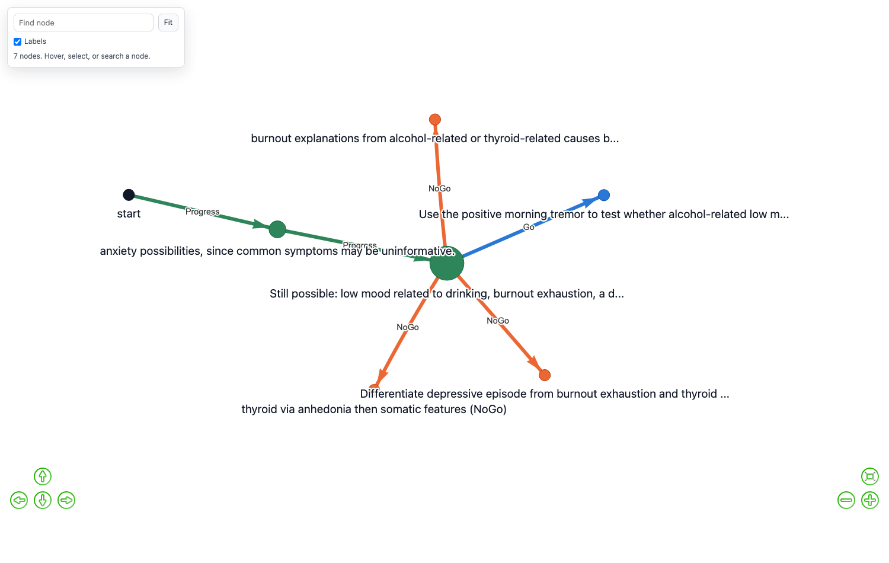

# A Worked Example: an agent that interviews, and remembers what it ruled out

A twenty-minute walkthrough of GoalGraph doing one job: **conducting an
interview with a person, and keeping track of what it has established and what
it has eliminated.**

The setting is a clinical intake — an agent working out which of several
conditions fits the person in front of it. That shape is common: a support
agent narrowing a fault, an onboarding agent working out what a customer
actually needs, a research assistant eliminating explanations. What they share
is that the agent must ask, listen, and *not ask the same thing twice*.

This is a puzzle rather than a clinical instrument. The conditions are
simplified past the point of clinical use and nothing here describes real
illness.

---

## The interaction

You talk to the agent. It opens, you answer, and it reasons out loud about what
your answer removed.

> **Dr Ellery** — Hello. Let's start with the practical problem that brought
> you in.
>
> **You** — My sister made me come. She says I have stopped answering my phone.
>
> **Dr Ellery** — That helps. Stopping answering the phone could go with
> several patterns, but on its own it rules out very little. Have you been
> turning down invitations and seeing people less?
>
> **You** — Yes.
>
> **Dr Ellery** — That suggests some withdrawal, which can happen in low mood,
> anxiety, or exhaustion, so it still doesn't settle it. Are you worrying about
> lots of different things on most days?
>
> **You** — No.
>
> **Dr Ellery** — That is useful. Broad day-to-day worry being absent makes
> generalised anxiety less likely, so I should look more at low mood or
> exhaustion patterns. Have you been feeling flat most of the day?
>
> **You** — Yes.
>
> **Dr Ellery** — That points more toward a depressive pattern than simple
> burnout, though I still want one feature that separates them cleanly. Are you
> sleeping a full night but waking exhausted anyway?
>
> **You** — No.
>
> **Dr Ellery** — That makes burnout-exhaustion less likely, because its sleep
> pattern is often a full night that still feels unrefreshing. Have you lost
> interest in things that normally still feel enjoyable?

Verbatim from a run. Three things in it are worth naming.

**The opening is a consequence, not a symptom.** "My sister made me come" is
not on any diagnostic list — it is what the symptoms *caused*. The agent has to
work backwards, which is how these conversations actually start.

**Each answer is scored by what it eliminated**, not by whether it was
interesting. "No" to broad worry removed generalised anxiety. "No" to
unrefreshing sleep removed burnout. That is the agent's own reasoning, and it
is also exactly what the graph records.

**The person answers what they are asked and nothing more.** No one volunteers
a structured symptom list. The agent's job is to choose the next question well,
because it only gets one per turn.

---

## What the graph recorded

While that conversation ran, the agent built this:



```
nodes 7   depth 3
Progress 2   NoGo 3   Go 1
every edge settled from evidence, none from opinion
```

Reading it against the transcript:

| in the graph | in the conversation |
|---|---|
| green `Progress` hops | a feature pinned down — the field genuinely narrowed |
| orange `NoGo` branches | a question that bought nothing, or a line abandoned |
| the blue `Go` | the diagnosis, once one candidate was left |
| the hub's label | the live candidate set at that moment |

The hub node is worth looking at: its label is *"Still possible: …"*, listing
what remains. That is the agent's position, written down. Everything hanging
off it is something tried from there.

**Verdicts are settled in code, not by a model rating itself.** A `Progress`
fires when a criterion is actually established; a `NoGo` when a question
re-treads settled ground or is deflected. That is why every edge above reads
`evidence` — the agent cannot award itself progress it did not make.

---

## Why a graph rather than the transcript

Because the transcript scrolls away, and because the next person is not this
person.

The agent above ran with an **eight-message window**. By the time it reached
the tenth question, the answer that removed generalised anxiety was long out of
view. Without somewhere to put it, the agent re-asks — and re-asking is the
failure mode people notice and resent.

Two things the graph does that a longer context does not:

**It keeps only what was settled.** A transcript is every word. The graph is
the handful of things established and the handful ruled out, which is a few
hundred characters rather than a few thousand.

**It survives the conversation.** The next person walks in and the agent
already knows which question separates burnout from a depressive pattern. That
is the part a bigger context window cannot give you.

---

## The next person, and the one after

Sixteen people seen in sequence by the same agent, its graph carried between
them. Each is a different presentation, and consecutive people rarely share an
answer, so a graph that memorised a conclusion would be wrong.

**13 of 16 correctly identified.**

The honest measure is within a condition — the same answer, a different person,
later in the run:

| condition | turns, first → later |
|---|---|
| generalised anxiety | 57 → **7** |
| panic with avoidance | 23 → **9** |
| obsessive checking | 17 → **9** |
| burnout exhaustion | ran out of turns → **35** |
| depressive episode | 25 → 21 → 27 |
| thyroid disturbance | 9 → 25 |
| alcohol-related low mood | 39 → ran out → ran out |

Four improved, one was flat, **two got worse**. Aggregated: the first eight
people took a mean of 28.3 turns, the last eight 19.0. The effect is real and
it is not uniform, and the two that degraded are shown because averaging them
away would misrepresent it.

After sixteen interviews the agent's graph looks like this:


```
nodes 34   edges 33   depth 6
Progress 15   NoGo 11   Go 7
4 edges revisited   3 contested
```

Seven blue terminals are seven conclusions reached. The spines share their
early nodes — where every interview starts — and diverge by condition.

**Revisited** and **contested** are the numbers that say reuse is happening.
Revisited means the agent walked a route it had built for someone else.
Contested means a later person contradicted one, and the route lost confidence
rather than being deleted:

| an edge's history | its weight |
|---|---|
| confirmed 4×, then contradicted once | 1.00 → 0.80 |
| seen once, then contradicted once | 1.00 → 0.50 |

A contradicted route keeps its label and records that something disagreed, so
the graph shows a route that has become doubtful rather than one that silently
changed its mind. The router costs routes at `1.1 − confidence`, so a doubtful
route quietly loses to a better one without anything being thrown away.

---

## Carrying the graph on the corpus task

The same comparison on the DDXPlus-derived clinic (`ddx_clinic`): eight
patients, HIV and influenza alternating, one arm inheriting the clinician's
graph each time (pruned to 40 nodes on transfer) and one starting fresh.

| arm | solved | turns when solved | tokens/run | routed aims |
|---|---|---|---|---|
| carried | **7/8** | 44.4 | 121k | **7** |
| fresh | 6/8 | **31.0** | 101k | 0 |

**Read it as reliability, not speed.** The carried arm solved one more case but
was slower per solve and ~20% dearer - recall is not free. The mechanically
interesting run is the last one: seven of its aims came from the graph's own
routing, nine edges were walked for the second time, one route was contradicted
and kept at reduced confidence - and the run solved with trust intact. That is
the first run in this project where the graph *chose the direction* rather than
only recalling dead ends.

Two earlier versions of this experiment failed for reasons worth keeping: with
unbounded inheritance the carried graph reached 179 nodes and that arm solved
nothing, and with the routing threshold above the similarity ceiling (0.55
against a metric that tops out near 0.46 on long goal briefs) routing was
impossible at any trust. Bounding transfer and lowering the gate are what made
the run above possible.


The same graph with ruled-out aims hidden - five investigation spines, each
ending in a diagnosis, the amber edge a route that was doubted and kept:


---

## The graph's advantage peaks where context is scarce but usable

Carried versus fresh at three context windows, eight patients each, same
sequence throughout:

| window | arm | solved | turns when solved | aims routed from the graph |
|---|---|---|---|---|
| 2 | carried | 1/8 | 21.0 | 44 |
| 2 | fresh | 0/8 | - | 0 |
| **3** | **carried** | **5/8** | **39.8** | **71** |
| **3** | **fresh** | **2/8** | **58.0** | **0** |
| 4 | carried | 7/8 | 44.4 | 7 |
| 4 | fresh | 6/8 | 31.0 | 0 |

**The advantage is an inverted U, and window three is its peak.** At four
messages the context nearly suffices: the graph is barely consulted (seven
routed aims), and carrying buys one extra solve at a speed cost. At two the
task is under its floor: the graph is heavily consulted but cannot rescue it.
At three - enough context to function, too little to hold the investigation -
the carried arm solves **5/8 against 2/8, eighteen turns faster when it
solves**, and consults the graph more than at any other window. It is the only
cell where carrying wins on reliability and speed at once.

Consultation tracks scarcity monotonically: 7 routed aims at window four, 71
at three, 44 at two (fewer than three because runs collapse before routes can
be walked). The agent substitutes the graph for the context it lacks, in
proportion to the lack - measured, not asserted.

The window-two graph shows what the floor looks like - no diagnoses reached,
dense dead-end fans:


### A screen of the tuning knobs, and what it caught

One knob moved at a time from its default, four-patient carried sequences at
window four. Four runs per cell ranks configurations and catches a knob that
is badly wrong; it cannot resolve small differences.

| config | change | solved | routed |
|---|---|---|---|
| baseline | - | 1/4 | 2 |
| route_easier | routing gate 0.40 → 0.33 | 2/4 | 17 |
| trust_gentler | trust decay 0.60 → 0.80 | 3/4 | 48 |
| abandon_faster | persistence 3→2, patience 6→4 | 2/4 | 31 |

The screen's most useful product is a caveat: **minimum trust was 1.0 in every
run of this study**, so the trust-decay mechanism never engaged - routed aims
were succeeding or drifting, never failing outright. That means
`trust_gentler` is mechanically identical to baseline here, and its 3/4 is the
luck of its particular chain, not the knob. What the screen does support:
easing the routing gate genuinely increases engagement (2 → 17 routed aims),
and faster abandonment buys nothing. A knob that cannot fire is the finding;
tuning it would have been noise-fitting.

### What transfer was costing, and what changed

An audit of the thirteen-turn overhead found the carried graph was
transferring one conversation's bookkeeping as if it were knowledge, three
ways at once:

- **Dead ends that die with the conversation were carried as prohibitions.**
  "You already asked that" is true of one interview and wrong for the next.
  NoGo nodes now carry a scope - a deflection any asker would hit transfers,
  re-asked settled ground does not.
- **Doubt was permanent.** An inherited claim kept its unverified flag even
  after this run's own evidence confirmed it, so recall hedged about settled
  facts every turn. Evidence now restores trust in a node.
- **The hedge itself instructed re-testing** - "treat as unconfirmed and worth
  re-testing" spends turns by design. It now reads "verify only if it becomes
  decision-relevant".

The window-two runs above are the first under the corrected transfer; the
window-four rows predate it. n = 8 per cell throughout, one model, two
conditions - these are demonstrations with measurements attached, not
estimates.

---

## The trust mechanism, finally observed working

A graph carried into the wrong problem should be *doubted*, not obeyed and not
deleted. That is what run-scoped trust is for: a route that fails costs the
graph credibility for the rest of that run, and a success earns it back.

For a long time every study reported the mechanism as never firing. That was
the measuring apparatus again - the exporter dropped the trust column and the
reading code defaulted the absence to 1.0. The session trails had the truth:
trust had been moving for days, down its exact designed ladder
(1.0 → 0.6 → 0.36 → 0.216 → 0.15 floor, with 0.25s marking recoveries).

The designed test: build the graph on HIV and influenza, then hand the agent
four sarcoidosis patients - hard, and profiled close enough to HIV that
inherited routes genuinely mislead.

| arm | runs where trust engaged | floor reached |
|---|---|---|
| carried | **6 of 8** | twice |
| fresh | 0 of 8 | - |

Trust engages exactly where designed: only when routes exist, dropping when
they mislead on the wrong-distribution patients, recovering on success. On
outcome, the only solved shifted run was a carried one, in eleven turns -
consistent with distrust-then-fallback working, though a single run proves
mechanism rather than advantage.

## The grid, restated under the anchored judge

The judge repair (see the development notes) forced a re-measurement of every
cell. This is the whole grid under the anchored judge - the judge that can
actually abandon a stalled line - with the flat-judge numbers kept for
comparison:

| window | arm | anchored: solved | turns | tokens/run | flat judge: solved |
|---|---|---|---|---|---|
| 2 | carried | **4/8** | 26.0 | **119k** | 1/8 |
| 2 | fresh | 2/8 | 22.0 | 149k | 0/8 |
| 3 | carried | 1/8 | 61.0 | 175k | 5/8 |
| 3 | fresh | 1/8 | 21.0 | 166k | 2/8 |
| 4 | carried | **4/8** | **25.0** | **124k** | 7/8 |
| 4 | fresh | 3/8 | 51.7 | 165k | 6/8 |

**Under the anchored judge, carrying wins on reliability, speed and cost at
once at window four** - 4/8 against 3/8, twice as fast when solving, a quarter
cheaper, because a run that solves early stops early. At window two it doubles
the solve rate. The flat-judge pattern - carried more reliable but slower -
inverts: with a judge that kills dead lines, the graph's routes convert
directly into speed.

**Window three is the anomaly and is reported as one.** Both arms collapsed to
1/8 there under the anchored judge, against healthier cells either side; n=8
per cell, the run-to-run variance on this task is large, and no story offered
here would be anything better than a fit to noise. It is the cell to re-run
first if anyone extends this.

Routing and trust are now routine rather than exceptional: 37-54 routed aims
per carried cell, and trust engaged in ten of the eleven carried runs where
routing occurred.


## The trust mechanism, finally observed working

A graph carried into the wrong problem should be *doubted*, not obeyed and not
deleted. That is what run-scoped trust is for: a route that fails costs the
graph credibility for the rest of that run, and a success earns it back.

For a long time every study reported the mechanism as never firing. That was
the measuring apparatus again - the exporter dropped the trust column and the
reading code defaulted the absence to 1.0. The session trails had the truth:
trust had been moving for days, down its exact designed ladder
(1.0 → 0.6 → 0.36 → 0.216 → 0.15 floor, with 0.25s marking recoveries).

The designed test: build the graph on HIV and influenza, then hand the agent
four sarcoidosis patients - hard, and profiled close enough to HIV that
inherited routes genuinely mislead.

| arm | runs where trust engaged | floor reached |
|---|---|---|
| carried | **6 of 8** | twice |
| fresh | 0 of 8 | - |

Trust engages exactly where designed: only when routes exist, dropping when
they mislead on the wrong-distribution patients, recovering on success. On
outcome, the only solved shifted run was a carried one, in eleven turns -
consistent with distrust-then-fallback working, though a single run proves
mechanism rather than advantage.

## The results above are judge-dependent, and the honest table says so

Re-running the window-three comparison under the anchored judge collapsed both
arms: carried 1/8 against fresh 1/8, where the flat judge gave 5/8 against
2/8. The anchored judge abandons stalled lines instead of rating them a
perpetual "5 / continue", and on this task that churn currently costs more
than it saves. Its rating distribution confirms the anchoring took: 21% of
judgements are now 3s, which literally never occurred before - but the
inverted-U table above was measured entirely under the flat judge, and the
carried-versus-fresh gap at window three does not survive the fix.

What survives judge-independently: routing engagement still scales with
scarcity, the trust mechanism works, and verdicts on keeper tasks were always
evidence-governed. What does not: the specific solve counts, until the grid is
re-measured under the anchored judge. This section exists so the table above
is read with that in mind.

---

## Run it yourself

```bash
python3 src/app.py
```

In the **Decision Graph** panel choose run type `clinic`, pick a condition, and
press Start. You are talking to the agent — answer as the person would, briefly,
and only what you are asked.

Watch the **Graph** tab while you talk. Nodes appear as the agent establishes
things, and **Hide ruled-out aims** collapses it to the route it is actually on.

To make the interaction repeatable instead — for evaluation, or to run sixteen
of them unattended — a second agent can take the person's seat:

```bash
python3 studies/validate_paradigm.py --quick   # the checks, ~1s, no LLM calls
```

Every setting these use is one you can set by hand in the panel, and every
number comes from the CSV its download button produces.

---

## What this does and does not show

**Shown.** An agent can conduct a multi-turn interview against a short context
window, record what it establishes and eliminates as it goes, and carry that
forward so the next interview starts better informed. Verdicts are settled from
evidence rather than self-assessment. The improvement across people is
measurable and it is visible in the graph.

**Not shown.** That this generalises: one model, one domain, and a single run
per person, so the turn counts are observations rather than estimates. That the
confidence decay is tuned correctly — two conditions got *worse* with reuse,
and the alcohol-related case degraded badly enough to be the most interesting
open question in the project. And nothing here measures whether the graph beats
simply giving the agent a longer context window, which is the comparison a
sceptical reader should want.

The task designs that failed on the way to this one, the regression that made
every graph shallow, and four occasions where the measuring tools produced a
number that looked like a result are in
[DEVELOPMENT_NOTES.md](DEVELOPMENT_NOTES.md).

---

## Extending it

The task lives in `src/agent/clinic_rules.py` — conditions, features, and the
rules for what a person will and will not say unprompted. To add a domain of
your own:

1. Write a rules module with pure predicates, and check every case is both
   distinguishable and *winnable*.
2. Add branches to `keeper.py` for `describe`, `opening`, `verdict`,
   `progress_made` and `is_complete` — and `roles()` if a second agent stands in
   for the person.
3. Add the id to the enum in `schemas.py` and the validator in `app.py`.

It appears in the Decision Graph panel automatically; the run-type list is
served from Python rather than hardcoded in the UI.
