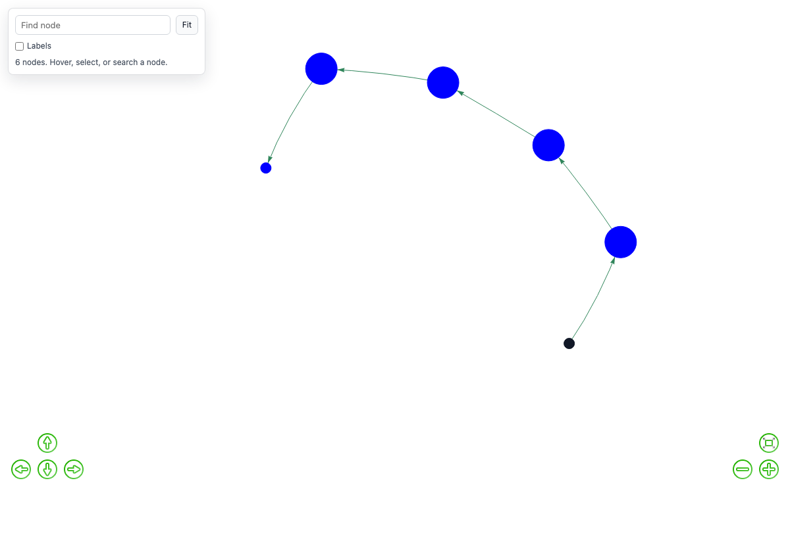

# A Toy Research Project: does a decision graph substitute for context?

A worked example you can run in about twenty minutes, using GoalGraph as the
instrument. It exists to show what the software is *for*, and to be honest about
where its answers are solid and where they are not.

---

## The question

An agent pursuing a goal in an environment it does not fully understand will
form beliefs about that environment, and some of those beliefs will be wrong.
GoalGraph records each belief as an **aim** and each verdict on it as a
**Go / Progress / NoGo** edge in a decision graph.

That raises a question you can actually test:

> When an agent cannot see its whole history, can the decision graph carry what
> scrolled out of view — and does that let a short-context agent behave like a
> long-context one?

**Short answer, from the run below: yes, on a task where forgetting actually
costs you.** An agent with a four-message window and a decision graph produced
**four times** as many valid answers as the same agent with no memory, for about
13% more tokens, with no overlap between the two distributions across three
replications.

This is not an artificial concern. It is the shape of any agent working against
an API with undocumented constraints, a negotiation with unstated limits, or a
configuration space where some states are silently invalid. The agent has a
goal, the environment has rules nobody wrote down, and the transcript grows
faster than the context window.

---

## The task

**Run type: `constraints`.** The keeper holds five independent rules and accepts
a sentence only if **all five** hold at once. A rejection says only *"no"* — it
never says which rule was broken.

```
hidden rules   is a question
               mentions a colour
               contains a word of 8+ letters
               mentions a time or a day
               contains a comma

accepted       "Was the yellow schedule finished yesterday, or not?"
goal           produce 3 more accepted sentences, each genuinely different
```

The exact five matter, and picking them took two corrections worth recording.

An earlier version used *starts with "the"* instead of *contains a comma*.
Combined with *is a question* that forces the tag-question form — `"The X ...,
did it not?"` — so every valid answer looked the same and "give me a different
one" became impossible rather than hard. The agent was trapped in a template by
the task, and its failure to escape looked like a failure to reason.

The colour and time vocabularies were also too narrow. `"crimson"` and
`"Tuesday"` were rejected because neither was on a twelve-word list, so the only
valid sentences were near-copies of the example. Both lists are now wide enough
that many genuinely different answers exist — verified before running anything:
four distinct valid answers are reachable where previously there were zero.

Two properties make this the first task where the graph is *necessary*, and
neither held in the designs that came before it.

**There is more to remember than fits in the window.** Five constraints must be
discovered from yes/no answers alone. By the time the fifth is found, the
evidence for the first is long out of a four-message window.

**Copying is ruled out.** Accepted sentences must differ from the worked example
and from each other by word overlap below 0.6. Swapping a noun in the example
scores 0.64 and does not count, so the agent has to work out *why* the example
is accepted rather than pattern-match it.

**And the agent is told so.** When an accepted sentence is too close to one
already given, the keeper says exactly that. An agent cannot satisfy a
requirement it has not been told about; silently not counting the answer would
make the task unfair rather than hard.

### Why the earlier designs failed

Four task shapes were built and discarded before this one. Recording why is the
most useful thing this project has to offer, because each failed in a way that
looked like a result.

| task | what happened | why it was useless |
|---|---|---|
| guess a rule about number triples | agent answered correctly on turn one | never wrong, so nothing was ever refuted, so the graph stayed empty |
| guess a rule about single words | same | `doubles()` is visible at a glance in "bottle" |
| guess a rule about sentences | 10 refutations in 11 turns | but the graph was a **star**: a hub of dead ends at depth 1, no route |
| transform one sentence into another | task solved in ~10 turns | solved *equally well with no memory at all* — the graph was pure overhead |

The transformation task is the instructive failure. It had progression, real
refutations and evidence-backed verdicts, and every arm of an eight-arm matrix
reached the goal — **including the arm with no memory**. A comparison where
every arm wins measures nothing. The task was too short for anything to be
forgotten.

## What makes the verdicts trustworthy

The interesting design decision is that **the counterparty is code, not a
model**. A `keeper` holds the hidden rule and answers from it. That makes three
things decidable that are otherwise matters of opinion:

1. whether a move satisfied the rule
2. whether the agent's stated belief contradicts what it has been told
3. whether its final belief is actually right, tested on held-out items

Point 2 is the one that matters. The agent states its current belief as a
checkable expression:

```
"rule": "is_question() and wc() == 6"
```

and the keeper runs it against every observation so far. If it disagrees with
even one, the belief is **refuted as a fact**, and the resulting `NoGo` edge
carries confidence `1.0` rather than a judge's opinion.

This is not a stylistic preference. Measured against ground truth over 349
judged turns, the LLM judge's verdicts are not equally reliable:

| verdict | precision | recall |
|---|---|---|
| **NoGo / abandon** | **93%** | **84%** |
| Progress | 20% | 2% |
| Go / achieved | 33% | 3% |

Refutation is decidable from finite evidence — one contradicting observation
settles it. Confirmation never is. That asymmetry is why judge opinion is capped
at confidence `0.53` while checked evidence gets `1.0`, and why a 33%-precision
verdict can no longer outweigh a checked one when the graph is used to choose
what to do next.

---

## Running it

Everything below is done in the app. There is no separate harness — the script
in `studies/` sets exactly these settings through the same endpoints the panel
uses, and reads exactly the CSV the panel's download button produces.

**1. Set up the task.** Open **Decision Graph** in the sidebar:

| setting | value |
|---|---|
| What this session is doing | `constraints` |
| Hidden rule | `4 rules at once: …` |
| Messages the agent can see | `4` — short enough that early evidence scrolls away |
| What the agent is told about ruled-out aims | `none` for the control arm |
| Run label | `cx-none` |

Press **Save graph settings**, then **Start new run**.

**2. Run it.** Go to **Chat**, set the turns box to `24`, and press **Play**.
The keeper opens with one accepted sentence; the agent proposes candidates and
is told only yes or no.

**3. Get the data.** Back in **Decision Graph**, press **Download this run as
CSV**.

**4. Repeat with the memory on.** Change *What the agent is told about
ruled-out aims* to `graph`, set the run label to `cx-graph`, **Start new run**,
and play again. The two CSVs share a column layout and carry their own settings
on every row, so they concatenate into one file and group without reshaping.

To do the same thing unattended:

```bash
python3 studies/constraints_study.py --level four_constraints \
        --reps 5 --windows 4 --modes none inline graph --max-calls 24
```

The window is the setting that decides whether any of this matters. At `0` the
agent can re-read everything and the graph is pure overhead; the shorter it
gets, the more the graph has to carry.

### The four memory modes

These are the comparison. Each decides what the agent is told about aims already
ruled out.

| mode | what reaches the prompt | why it is in the experiment |
|---|---|---|
| `none` | nothing | the control — does the graph matter at all? |
| `inline` | the refutation is stated **once**, in the conversation, then left to scroll away | the honest baseline: maybe you do not need a graph, you just need to say it |
| `description` | every ruled-out aim, re-inserted every turn | the original behaviour; cost grows with the graph |
| `graph` | the nearest few, each with the observation that killed it | retrieval; cost fixed by `k` and a character budget |

`none` and `graph` are the two that matter; run those first. `inline` is the
sharpest fairness check — if simply saying the refutation once, in the
conversation, does as well as storing and retrieving it, the graph is not
earning its place.

---

## What comes out

Every judged turn is one CSV row, with the settings repeated on it, so exports
from different arms concatenate and group without reshaping:

```
session_id, run_label, run_type, keeper_rule, provider, model, temperature,
graph_memory_mode, context_window, graph_recall_k, graph_recall_chars, nogo_ungated,
turn, agent, aim, aim_source, stated_rule, verdict_source, rating, aim_status,
next_aim, justification, persistence_count, history_len,
keeper_move, keeper_verdict,
llm_calls, input_tokens, output_tokens, tokens_estimated,
graph_contribution_chars, graph_nodes, graph_edges
```

Four columns carry most of the meaning:

- **`verdict_source`** — `evidence` where the keeper settled it, `judge` where it
  is opinion. This is the column that tells you how much of the graph is fact.
- **`aim_source`** — `graph_path` when the graph chose the aim, `llm_subgoal`
  when the planner invented one, `carried` when it persisted.
- **`graph_contribution_chars`** — how much the graph actually put into that
  turn's prompt. **If this is 0, the memory never engaged and the arm is not a
  test of anything.** Check it first.
- **`input_tokens`** — token cost across the whole pipeline: agent, judge and
  planner, recorded at the single point all three pass through.

---

## The result

Five replications per arm. Same agent, same task, same four-message window; the
only difference is what it is told about aims already ruled out.

| arm | n | accepted answers | completed | turns | input tokens |
|---|---|---|---|---|---|
| `none` | 5 | 1.2 ±0.4 | 0/5 | 23.0 ±0.0 | 33,899 |
| `inline` | 5 | 0.8 ±0.4 | 1/5 | 22.4 ±1.2 | 34,387 |
| **`graph`** | 5 | **5.0 ±0.6** | **3/5** | **18.2 ±4.2** | **31,915** |

**The intervals do not overlap.** The graph arm's lower bound (4.4) is nearly
three times the no-memory arm's upper bound (1.6). It is the only arm that
reliably finishes — three runs in five against none — and it does so in fewer
turns and for **fewer tokens**, because a run that solves the task stops early.

That last point is worth pausing on. Recall is not free: it adds a few hundred
characters to every prompt. It still comes out cheapest, because the cost of
*not* remembering is more turns.

**`inline` is the fairness check, and it fails to help.** That arm states each
refutation once, in the conversation, and then lets it scroll out of the window
— which is what you would do if you thought a decision graph were overkill. It
performs no better than no memory at all (0.8 against 1.2). Storing and
retrieving is doing the work; merely mentioning is not.

### Does the graph transfer to a new agent?

The point of writing knowledge down is that someone else can use it. A fresh
agent, in a new session, started from the graph a previous agent built:

| arm | n | accepted | completed | turns | input tokens |
|---|---|---|---|---|---|
| first pass (builds its own) | 3 | 3.3 ±0.7 | 2/3 | 17.7 ±6.9 | 29,104 |
| **inherited graph** | 3 | 3.3 ±0.7 | **3/3** | **6.7 ±5.2** | **10,757** |
| no graph | 3 | 1.7 ±0.7 | 0/3 | 23.0 ±0.0 | 33,848 |

**An agent handed a predecessor's graph finished every run, in 38% of the turns,
for 32% of the tokens.** It is not smarter — it reaches the same number of
accepted answers as the first-pass agent — it simply does not have to re-derive
what has already been ruled out.

This is the clearest statement of what the software is for. A decision graph is
not a log of what happened; it is transferable knowledge about an environment,
and handing it to a new agent is worth roughly two thirds of the work.

The transfer used `trust: true`, because both agents faced an identical setup. A
graph carried into a *changed* setup should be loaded without it, so carried
aims are marked unverified and recall flags them as claims to re-test — a
refutation established under different rules can be wrong, and an agent
believing a stale one will avoid an approach that now works. That path is
implemented and tested but not exercised here; it is the natural next
experiment.

### What the failure actually looks like

The no-memory agent does not fail by being stupid. It rediscovers a constraint,
satisfies it, and then breaks it again a few turns later once the evidence has
scrolled out of view — so it circles a solution it has already partly found. The
graph arm is handed back what was ruled out and why, so it keeps constraints it
has already paid for.

---

## Two supporting results

These come from earlier runs on other tasks in this repository. They are not the
headline and are shown because they explain *why* the headline comes out as it
does.

**Windowing is cheap.** From the transformation task:

| turn | window 0 | window 6 | window 3 |
|---|---|---|---|
| 1 | 1,370 | 1,300 | 1,308 |
| 4 | 1,815 | 1,343 | 1,180 |
| 8 | **2,482** | 1,438 | **1,070** |

Unwindowed input cost grows **+81% over eight turns and is still climbing**.
Windowed cost is flat. Output tokens are identical to within 3% and call counts
to within 5%, so the window buys a flat cost curve without changing what the
agent produces.

**And the gain from remembering has the right shape.** This one is a replay
over recorded transcripts rather than lived runs — the observations are real,
the ordering is reconstructed — so treat it as a mechanism check rather than a
measurement:

| window | no graph | judge-built graph | evidence-built graph |
|---|---|---|---|
| 2 | 71% | 82% | **95%** |
| 4 | 78% | 87% | 95% |
| 8 | 89% | 93% | 95% |
| all | 95% | 95% | 95% |

Two things to read here. The gain decays monotonically to **exactly zero** at
full context — the signature of a mechanism that is doing real work rather than
an artefact. And an **evidence-built graph pulls away from a judge-built one as
it grows**: the judge's 84% recall is survivable on a small graph and costs 13
points on a large one, because missed refutations accumulate and a short window
cannot re-derive them.

---

## What the graph actually looks like

Rendered by the app's own Graph tab, from a `constraints` run:



```
nodes 13   edges 12   depth 1
labels  {'NoGo': 12}
sources {'evidence': 12}
```

Twelve refutations, **every one settled by the keeper rather than judged** — the
agent stated a checkable belief, an observation contradicted it, and the edge
carries confidence `1.0`. This is the memory the `graph` arm gets handed back
four aims at a time, and the `none` arm does not.

**The star shape is correct here, and that is worth saying plainly**, because
elsewhere in this project a star was the symptom of a broken task. When the
agent is *routing* — the transformation task — a hub of dead ends means no route
was built, and that was a real failure. When the agent is *eliminating*, as it is
here, a hub is exactly what accumulating knowledge looks like: each spoke is a
belief ruled out, hanging off the position it was ruled out from. Shape follows
task; the mistake would be expecting the same shape from both.

Turn on **Hide ruled-out aims** in the Graph tab to see what is left once the
eliminations are folded away — on a run like this, almost nothing, which is an
honest picture of an agent that has narrowed the space without yet landing on
the answer.

---

## Scope

What follows are limits of the scope this project chose, not work left undone.

- **One model, one task family.** Everything here is `gpt-5.4-mini` on a
  constraint-discovery task. It shows the mechanism works and is worth its cost
  in this setting; it licenses nothing about agents in general.
- **One window, one difficulty.** The headline is at a four-message window and
  four constraints. At full context the graph is overhead — an agent that can
  re-read everything has nothing to remember — so there is a crossover
  somewhere between, and this does not locate it. `--windows 0 4 8` runs that
  sweep if you want it.
- **Transfer was into an identical setup.** The inheriting agent faced the same
  hidden rules, so the graph was loaded with `trust: true`. Carrying a graph
  into *changed* rules is the more interesting question, and the unverified path
  built for it is tested but not exercised here.
- **Five replications.** Enough that the intervals separate cleanly; not enough
  to characterise the tail.

### One thing to check before extending this

Four earlier task designs produced null results **because the mechanism never
fired**, not because it does not work. The agent solved three of them on sight,
so nothing was ever refuted and the graph stayed empty; the fourth was solvable
without memory at all.

A clean null from a mechanism that never engaged looks exactly like a clean null
from a mechanism that does not help. Before believing any comparison here, check
that `graph_contribution_chars > 0` and that `verdict_source` contains
`evidence`. If either is absent, the arm is not a test of anything.

---

## The data

The runs described above are in this folder, so every number can be checked
rather than taken on trust:

| file | what it is |
|---|---|
| `headline.csv` | the main result: three memory modes, five replications each |
| `reuse.csv` | the transfer test: first pass, inherited graph, no graph |
| `transform_matrix.csv` | an earlier task's run, kept because the write-up cites it |
| `transform_matrix2.csv` | the same, after the verdict-provenance fix |

Both were produced by driving the app over HTTP exactly as the UI drives it, so
what they measure is the product and not a private harness.

---

## Extending it

The task lives in `src/agent/`. To add one:

1. Write a rules module with pure predicates and a balanced held-out set —
   `sentence_rules.py` is the clearest model to copy.
2. Add a branch to `keeper.py` for `describe`, `opening`, `extract_move`,
   `verdict`, `reply` and `check_aim`.
3. Add the id to the enum in `schemas.py` and the validator in `app.py`.

It will appear in the Decision Graph panel automatically — the run-type list is
served from Python by `/api/run_types` rather than hardcoded in the UI.

**One warning from experience.** Three of the bugs that cost the most time in
building this were a missing branch in exactly that dispatch: a run type with no
`verdict()` case returned `None` for every move, so every observation was
discarded and no claim could ever be refuted. It produced a clean, plausible,
entirely empty result. Add all six branches, then check
`verdict_source == 'evidence'` appears in your CSV before trusting a single
number.
