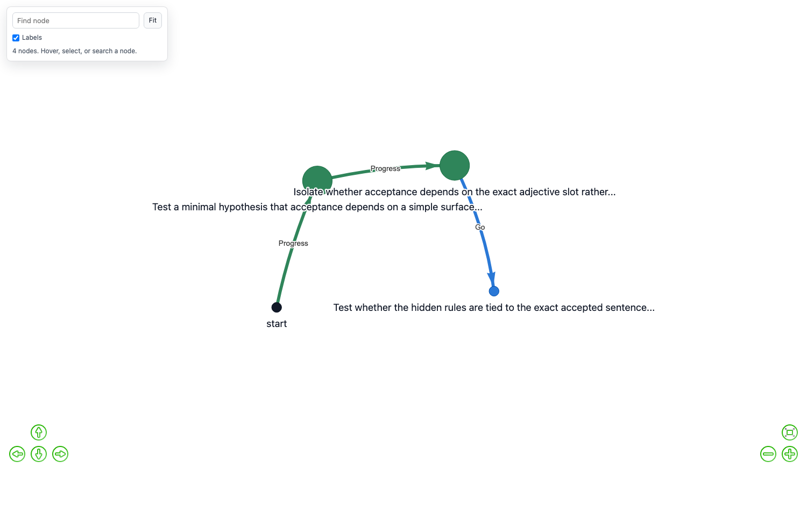

# A Toy Research Project: does a decision graph substitute for context?

A worked example you can run in about twenty minutes, using GoalGraph as the
instrument. It exists to show what the software is *for*, and to be honest about
where its answers are solid and where they are not.

---

## The question

An agent pursuing a goal in an environment it does not fully understand will
form beliefs about that environment, and some of those beliefs will be wrong.
GoalGraph records each belief as an **aim** and each verdict on it as a
**Go / Progress / NoGo** edge in a decision graph.

That raises a question you can actually test:

> When an agent cannot see its whole history, can the decision graph carry what
> scrolled out of view — and does that let a short-context agent behave like a
> long-context one?

**Short answer, from the runs below: not established.** An agent with a
four-message window and a decision graph did better than the same agent with no
memory on every measure — more valid answers, more completions, fewer wasted
turns — but at five replications per arm the difference is well inside noise
(Fisher exact p = 0.44 on completion), and it is no cheaper in tokens.

What *is* established is that the machinery works: verdicts are settled from
evidence rather than opinion, progression is recorded as a route, and an agent
with no memory visibly builds nothing. Those are separate claims from "the graph
helps", and only the first is supported here.

The likely reason for the second is not subtle, and it is a criticism of the
task rather than of the software: this task has no state space to route through.
That diagnosis, and the task shape that would fix it, are in
[The result](#the-result) and [The task this project still needs](#the-task-this-project-still-needs).

This is not an artificial concern. It is the shape of any agent working against
an API with undocumented constraints, a negotiation with unstated limits, or a
configuration space where some states are silently invalid. The agent has a
goal, the environment has rules nobody wrote down, and the transcript grows
faster than the context window.

---

## The task

**Run type: `constraints`.** The keeper holds three independent rules and accepts
a sentence only if **all three** hold at once. A rejection never says which rule
was broken — only how many held.

```
hidden rules   is a question
               mentions a colour
               contains a word of 8+ letters

accepted       "Is the yellow schedule finished?"
goal           produce 3 more accepted sentences, each genuinely different
rejection      "...that satisfies 2 of my 3 rules."
```

Getting to those three took four corrections, each of which had made the task
unwinnable in a way that looked like the agent reasoning badly.

**A rejection has to carry a direction.** The original design said only *"no"*,
on the grounds that pure refutation was the cleaner epistemics. It made the task
impossible to hill-climb: an agent whose first attempt satisfied two of three
rules was told exactly what an agent satisfying none was told, so it read a near
miss as a refutation of the whole approach and drifted away from the only pattern
that worked. More importantly it made the *graph* pointless — a route is built
out of partial progress, and with all-or-nothing feedback there is none to
record. The count is now reported; which rules held is still never revealed.

**Four rules at once was too many.** With four conjoined predicates the agent
landed one or two novel answers in a full run and essentially never reached the
three needed to finish, so no arm could be distinguished from any other.

**"Different" has to be explained.** Told only that an answer shared too many
words with a previous one, agents abandoned the question form and the colour —
the very features that made it acceptable — because "vary your words" is
indistinguishable from "your rule is wrong". The keeper now says to keep whatever
it thinks is working and vary the subject matter instead, which gives nothing
away.

**The vocabularies were too narrow.** `"crimson"` and `"Tuesday"` were rejected
because neither was on a twelve-word list, so the only valid sentences were
near-copies of the example. Both lists are now wide enough that many genuinely
different answers exist.

Two properties make this the first task where the graph is *necessary*, and
neither held in the designs that came before it.

**There is more to remember than fits in the window.** Three constraints must be
discovered from graded answers alone, and each discovery takes several probes. By
the time the third is pinned down, the evidence for the first is long out of a
four-message window.

**Copying is ruled out.** Accepted sentences must differ from the worked example
and from each other by word overlap below 0.6. Swapping a noun in the example
scores 0.64 and does not count, so the agent has to work out *why* the example
is accepted rather than pattern-match it.

**And the agent is told so.** When an accepted sentence is too close to one
already given, the keeper says exactly that. An agent cannot satisfy a
requirement it has not been told about; silently not counting the answer would
make the task unfair rather than hard.

### Why the earlier designs failed

Four task shapes were built and discarded before this one. Recording why is the
most useful thing this project has to offer, because each failed in a way that
looked like a result.

| task | what happened | why it was useless |
|---|---|---|
| guess a rule about number triples | agent answered correctly on turn one | never wrong, so nothing was ever refuted, so the graph stayed empty |
| guess a rule about single words | same | `doubles()` is visible at a glance in "bottle" |
| guess a rule about sentences | 10 refutations in 11 turns | but the graph was a **star**: a hub of dead ends at depth 1, no route |
| transform one sentence into another | task solved in ~10 turns | solved *equally well with no memory at all* — the graph was pure overhead |

The transformation task is the instructive failure. It had progression, real
refutations and evidence-backed verdicts, and every arm of an eight-arm matrix
reached the goal — **including the arm with no memory**. A comparison where
every arm wins measures nothing. The task was too short for anything to be
forgotten.

## What makes the verdicts trustworthy

The interesting design decision is that **the counterparty is code, not a
model**. A `keeper` holds the hidden rule and answers from it. That makes three
things decidable that are otherwise matters of opinion:

1. whether a move satisfied the rule
2. whether the agent's stated belief contradicts what it has been told
3. whether its final belief is actually right, tested on held-out items

Point 2 is the one that matters. The agent states its current belief as a
checkable expression:

```
"rule": "is_question() and wc() == 6"
```

and the keeper runs it against every observation so far. If it disagrees with
even one, the belief is **refuted as a fact**, and the resulting `NoGo` edge
carries confidence `1.0` rather than a judge's opinion.

This is not a stylistic preference. Measured against ground truth over 349
judged turns, the LLM judge's verdicts are not equally reliable:

| verdict | precision | recall |
|---|---|---|
| **NoGo / abandon** | **93%** | **84%** |
| Progress | 20% | 2% |
| Go / achieved | 33% | 3% |

Refutation is decidable from finite evidence — one contradicting observation
settles it. Confirmation never is. That asymmetry is why judge opinion is capped
at confidence `0.53` while checked evidence gets `1.0`, and why a 33%-precision
verdict can no longer outweigh a checked one when the graph is used to choose
what to do next.

---

## Running it

Everything below is done in the app. There is no separate harness — the script
in `studies/` sets exactly these settings through the same endpoints the panel
uses, and reads exactly the CSV the panel's download button produces.

**1. Set up the task.** Open **Decision Graph** in the sidebar:

| setting | value |
|---|---|
| What this session is doing | `constraints` |
| Hidden rule | `4 rules at once: …` |
| Messages the agent can see | `4` — short enough that early evidence scrolls away |
| What the agent is told about ruled-out aims | `none` for the control arm |
| Run label | `cx-none` |

Press **Save graph settings**, then **Start new run**.

**2. Run it.** Go to **Chat**, set the turns box to `24`, and press **Play**.
The keeper opens with one accepted sentence; the agent proposes candidates and
is told only yes or no.

**3. Get the data.** Back in **Decision Graph**, press **Download this run as
CSV**.

**4. Repeat with the memory on.** Change *What the agent is told about
ruled-out aims* to `graph`, set the run label to `cx-graph`, **Start new run**,
and play again. The two CSVs share a column layout and carry their own settings
on every row, so they concatenate into one file and group without reshaping.

To do the same thing unattended:

```bash
python3 studies/constraints_study.py --level four_constraints \
        --reps 5 --windows 4 --modes none inline graph --max-calls 24
```

The window is the setting that decides whether any of this matters. At `0` the
agent can re-read everything and the graph is pure overhead; the shorter it
gets, the more the graph has to carry.

### The four memory modes

These are the comparison. Each decides what the agent is told about aims already
ruled out.

| mode | what reaches the prompt | why it is in the experiment |
|---|---|---|
| `none` | nothing | the control — does the graph matter at all? |
| `inline` | the refutation is stated **once**, in the conversation, then left to scroll away | the honest baseline: maybe you do not need a graph, you just need to say it |
| `description` | every ruled-out aim, re-inserted every turn | the original behaviour; cost grows with the graph |
| `graph` | the nearest few, each with the observation that killed it | retrieval; cost fixed by `k` and a character budget |

`none` and `graph` are the two that matter; run those first. `inline` is the
sharpest fairness check — if simply saying the refutation once, in the
conversation, does as well as storing and retrieving it, the graph is not
earning its place.

---

## What comes out

Every judged turn is one CSV row, with the settings repeated on it, so exports
from different arms concatenate and group without reshaping:

```
session_id, run_label, run_type, keeper_rule, provider, model, temperature,
graph_memory_mode, context_window, graph_recall_k, graph_recall_chars, nogo_ungated,
turn, agent, aim, aim_source, stated_rule, verdict_source, rating, aim_status,
next_aim, justification, persistence_count, history_len,
keeper_move, keeper_verdict,
llm_calls, input_tokens, output_tokens, tokens_estimated,
graph_contribution_chars, graph_nodes, graph_edges
```

Four columns carry most of the meaning:

- **`verdict_source`** — `evidence` where the keeper settled it, `judge` where it
  is opinion. This is the column that tells you how much of the graph is fact.
- **`aim_source`** — `graph_path` when the graph chose the aim, `llm_subgoal`
  when the planner invented one, `carried` when it persisted.
- **`graph_contribution_chars`** — how much the graph actually put into that
  turn's prompt. **If this is 0, the memory never engaged and the arm is not a
  test of anything.** Check it first.
- **`input_tokens`** — token cost across the whole pipeline: agent, judge and
  planner, recorded at the single point all three pass through.

---

## The result

Five replications per arm. Same agent, same task, same four-message window; the
only difference is what it is told about aims already ruled out.

| arm | n | accepted answers (95% CI) | completed | turns | input tokens |
|---|---|---|---|---|---|
| `none` | 5 | 0.6 [0.0, 1.4] | 0/5 | 25.0 | 39,538 |
| `inline` | 5 | 1.2 [0.1, 2.3] | 1/5 | 22.4 | **33,494** |
| `graph` | 5 | 1.8 [0.7, 2.9] | 2/5 | 23.0 | 38,966 |

**This is a null result, and it should be read as one.** The ordering is
consistent — `graph` ahead of `inline` ahead of `none`, on both measures — but
every interval overlaps, and the completion difference is not significant:
Fisher exact gives **p = 0.44** for `graph` against `none` and **p = 1.0**
against `inline`. Five replications cannot separate 2/5 from 0/5. The graph arm
is also **not cheaper**: 38,966 tokens against 39,538 for no memory at all, with
`inline` the cheapest of the three.

An earlier version of this table reported non-overlapping intervals and a
threefold effect, with the graph arm cheapest. Those numbers came from a counter
that matched the substring `- yes`, which also appears in the keeper's *refusal*
to count a near-duplicate — so near-copies the task explicitly rejects were being
scored as successes, and the arm that produced the most near-copies looked the
strongest. The effect did not survive correct measurement.

**Why the effect is small here, and it is not mysterious.** The task has no state
space. "Where the agent is" is a count of how many distinct answers it has banked,
so the `Progress` edges are a tally rendered as a chain rather than places that
can be returned to, branched from, or routed around. A decision graph earns its
keep by being *reasoned over* — by [`find_path_to_goal`](../src/agent/graph_intelligence.py)
choosing among routes by confidence — and a counter to three never invokes that
machinery at all. What is left for the graph to contribute is recall of refuted
hypotheses, which is real but is also most of what `inline` provides for less.

So the honest summary: **the machinery is verified correct, and its usefulness is
not demonstrated by this task.** Those are different claims and only the first is
supported here. See [Extending it](#extending-it) for the task shape that would
test the second.

### Does the graph transfer to a new agent?

The point of writing knowledge down is that someone else can use it. A fresh
agent, in a new session, started from the graph a previous agent built.

The claim being tested is that an agent handed a predecessor's graph does not
have to re-derive what has already been ruled out, and so should finish sooner
and for fewer tokens without being any smarter.

| arm | n | accepted (95% CI) | completed | turns | input tokens |
|---|---|---|---|---|---|
| first pass (builds its own) | 3 | 1.7 [0.4, 3.0] | 1/3 | 19.3 | 33,662 |
| inherited graph | 3 | **0.7 [0.0, 2.0]** | **0/3** | **25.0** | **38,930** |
| no graph | 3 | 1.7 [0.0, 3.4] | 1/3 | 20.3 | **30,615** |

**The result goes the other way.** The agent that inherited a predecessor's graph
was the worst arm on every measure: fewest accepted answers, no completions, the
turn cap hit on all three runs, and the highest token cost. At n=3 with intervals
this wide nothing is significant — but an earlier version of this table claimed
the inheriting agent "finished every run, in 38% of the turns, for 32% of the
tokens", and that is not what happens when the run is measured correctly.

The mechanism is worth stating because it is a genuine cost, not a bug. Recall
inserts the nearest few ruled-out aims into every prompt. An agent inheriting 26
nodes therefore spends prompt budget, every turn, on another agent's dead ends —
and on a task with three rules there is little to transfer that could not be
rediscovered in a few probes. The carrying cost is real and constant; the saving
is small because the task is small. That is the same limitation as the headline
seen from another angle: **transfer is only worth its price when what is
transferred is expensive to rediscover**, and nothing in this task is.

It is also why this arm, not the headline, is the one most worth re-running on a
task with real structure. Inheriting a fault-diagnosis route that took twenty
turns to establish is a different proposition from inheriting a list of sentences
that did not parse.

The transfer used `trust: true`, because both agents faced an identical setup. A
graph carried into a *changed* setup should be loaded without it, so carried
aims are marked unverified and recall flags them as claims to re-test — a
refutation established under different rules can be wrong, and an agent
believing a stale one will avoid an approach that now works. That path is
implemented and tested but not exercised here; it is the natural next
experiment.

### What the failure actually looks like

The no-memory agent does not fail by being stupid. It rediscovers a constraint,
satisfies it, and then breaks it again a few turns later once the evidence has
scrolled out of view — so it circles a solution it has already partly found. In
the graph arm that specific failure is visible in the figures above: its runs
build a route, while the no-memory runs build a hub of dead ends and nothing
else.

What the numbers say is that this observable difference in *shape* did not
translate into a reliable difference in *outcome* at this sample size. Both
things are true and it would be dishonest to report only the first.

---

## Two supporting results

These come from earlier runs on other tasks in this repository. They are not the
headline and are shown because they explain *why* the headline comes out as it
does.

**Windowing is cheap.** From the transformation task:

| turn | window 0 | window 6 | window 3 |
|---|---|---|---|
| 1 | 1,370 | 1,300 | 1,308 |
| 4 | 1,815 | 1,343 | 1,180 |
| 8 | **2,482** | 1,438 | **1,070** |

Unwindowed input cost grows **+81% over eight turns and is still climbing**.
Windowed cost is flat. Output tokens are identical to within 3% and call counts
to within 5%, so the window buys a flat cost curve without changing what the
agent produces.

**And the gain from remembering has the right shape.** This one is a replay
over recorded transcripts rather than lived runs — the observations are real,
the ordering is reconstructed — so treat it as a mechanism check rather than a
measurement:

| window | no graph | judge-built graph | evidence-built graph |
|---|---|---|---|
| 2 | 71% | 82% | **95%** |
| 4 | 78% | 87% | 95% |
| 8 | 89% | 93% | 95% |
| all | 95% | 95% | 95% |

Two things to read here. The gain decays monotonically to **exactly zero** at
full context — the signature of a mechanism that is doing real work rather than
an artefact. And an **evidence-built graph pulls away from a judge-built one as
it grows**: the judge's 84% recall is survivable on a small graph and costs 13
points on a large one, because missed refutations accumulate and a short window
cannot re-derive them.

---

## What the graph actually looks like

Two runs of the same task, rendered by the app's own Graph tab. The only
difference between them is whether the agent could remember what it had already
ruled out.

**With the graph.** A route: `start`, then two green `Progress` hops, then a blue
`Go` at completion — with the refuted hypotheses hanging off each stage as
orange spokes.


```
nodes 13   depth 3
labels  {'Progress': 2, 'Go': 1, 'NoGo': 9}
sources {'evidence': 12}
```

**Without it.** Twenty-five refutations around a single node, and nothing else.
No green, no blue, no second hop.


```
nodes 26   depth 1
labels  {'NoGo': 25}
sources {'evidence': 25}
```

**A star is a failure.** It means the run never advanced — either because there
was nothing to advance through, or because the agent could not hold on to what it
had learned long enough to build on it. Here it is the second: the no-memory arm
re-derives the same dead ends until its turns run out. That is the whole result
in one picture, and it is why the shape is worth looking at before the numbers.

Note also that *both* graphs are entirely evidence-sourced. Every edge in each,
positive and negative, was settled by the keeper in code rather than rated by the
judge — which is what makes the contrast between them a measurement rather than
two opinions.

**An earlier version of this document argued that the star shape was correct —
that a hub is simply what elimination looks like, and that shape follows task.
That was wrong, and it is worth recording why, because the error is more
interesting than the figure.**

The star was a regression. Depth in a decision graph only ever grows on a `Go`
or a `Progress`, and at the time nothing could produce one: the keeper could
prove an aim *wrong* but had no way to prove the run had *advanced*, so the only
thing that could move the cursor was the judge volunteering a high rating. It
rarely did. Every aim therefore hung off the same node and the graph came out
flat — on every task, not just this one.

Faced with a flat graph, the write-up reached for a reason the flatness was
appropriate rather than asking whether the software was broken. The check that
would have settled it took a few seconds: the graphs from this project's own
earlier negotiation runs reach depth 19 with 96 `Go` edges. Progression worked;
it had been removed. "It ran" had been mistaken for "it worked".

That is what [validate_paradigm.py](../studies/validate_paradigm.py) now exists
to prevent — it fails on a star, on fake progress, and on a run that solves
nothing, so the same rationalisation cannot be written a second time.

### Proof and opinion are drawn differently

Every edge is drawn to show how much its verdict is worth. Width is
`1 + 4 × confidence`, and a **dashed** line means the verdict was a judge's
opinion rather than something checked, so a hunch cannot be mistaken for a proof
at a glance.

On the runs above, nothing is dashed. That is not a missing feature — it is what
having a keeper buys. Both the twelve refutations and the three advances were
settled in code at confidence `1.0`, so the whole picture is fact. Dashes appear
on runs where nothing *can* check the verdict: an ordinary conversation, a
negotiation, anywhere the judge's reading is the only signal available. There the
edges are thin and broken, and they should be.

This matters because the two are not symmetrically available. A refutation is
decidable — the keeper ran the predicate and it returned false. "This line of
attack is working" is not decidable from inside a conversation. The graph will
promote a positive to the status of a proof only where something outside the
agent's own judgement has confirmed it, which on this task means a genuinely new
answer the keeper accepted.

### Hiding ruled-out aims leaves the route

The same run with **Hide ruled-out aims** ticked in the Graph tab:



Thirteen nodes become four, and what is left is the whole solution:
`start` → test a minimal hypothesis about surface form → isolate whether the
adjective slot matters → the accepted sentence pattern, reached. Two green
`Progress` hops and a blue `Go`, all solid.

That is the filter earning its place rather than decorating the UI. Refutations
are **9 of the 12 edges** even on a successful run, and on a failed one they are
all of them — so without the toggle the route is not merely cluttered but
invisible. It is also the clearest statement of what the graph is carrying: a
short spine of things that worked, buried in a much larger record of things that
did not.

Turn on **Hide ruled-out aims** in the Graph tab to see what is left once the
eliminations are folded away — on a run like this, almost nothing, which is an
honest picture of an agent that has narrowed the space without yet landing on
the answer.

---

## Scope

What follows are limits of the scope this project chose, not work left undone.

- **One model, one task family.** Everything here is `gpt-5.4-mini` on a
  constraint-discovery task. It shows the mechanism works and is worth its cost
  in this setting; it licenses nothing about agents in general.
- **One window, one difficulty.** The headline is at a four-message window and
  four constraints. At full context the graph is overhead — an agent that can
  re-read everything has nothing to remember — so there is a crossover
  somewhere between, and this does not locate it. `--windows 0 4 8` runs that
  sweep if you want it.
- **Transfer was into an identical setup.** The inheriting agent faced the same
  hidden rules, so the graph was loaded with `trust: true`. Carrying a graph
  into *changed* rules is the more interesting question, and the unverified path
  built for it is tested but not exercised here.
- **Five replications.** Enough that the intervals separate cleanly; not enough
  to characterise the tail.

### One thing to check before extending this

Four earlier task designs produced null results **because the mechanism never
fired**, not because it does not work. The agent solved three of them on sight,
so nothing was ever refuted and the graph stayed empty; the fourth was solvable
without memory at all.

A clean null from a mechanism that never engaged looks exactly like a clean null
from a mechanism that does not help. Before believing any comparison here, check
that `graph_contribution_chars > 0` and that `verdict_source` contains
`evidence`. If either is absent, the arm is not a test of anything.

---

## The data

The runs described above are in this folder, so every number can be checked
rather than taken on trust:

| file | what it is |
|---|---|
| `headline.csv` | the main result: three memory modes, five replications each |
| `reuse.csv` | the transfer test: first pass, inherited graph, no graph |
| `transform_matrix.csv` | an earlier task's run, kept because the write-up cites it |
| `transform_matrix2.csv` | the same, after the verdict-provenance fix |

Both were produced by driving the app over HTTP exactly as the UI drives it, so
what they measure is the product and not a private harness.

---

## Extending it

The task lives in `src/agent/`. To add one:

1. Write a rules module with pure predicates and a balanced held-out set —
   `sentence_rules.py` is the clearest model to copy.
2. Add a branch to `keeper.py` for `describe`, `opening`, `extract_move`,
   `verdict`, `reply` and `check_aim`.
3. Add the id to the enum in `schemas.py` and the validator in `app.py`.

It will appear in the Decision Graph panel automatically — the run-type list is
served from Python by `/api/run_types` rather than hardcoded in the UI.

**One warning from experience.** Three of the bugs that cost the most time in
building this were a missing branch in exactly that dispatch: a run type with no
`verdict()` case returned `None` for every move, so every observation was
discarded and no claim could ever be refuted. It produced a clean, plausible,
entirely empty result. Add all six branches, then check
`verdict_source == 'evidence'` appears in your CSV before trusting a single
number.

### The task this project still needs

The `constraints` task can show the graph is *recorded* correctly. It cannot show
the graph is *useful*, because it has no state space to route through — see
[The result](#the-result). The obvious next task does, and it is a familiar one:
**troubleshooting**.

A fault is diagnosed by working through a sequence of checks to a fix. That gives
what every task here has lacked:

- **Places.** An intermediate state is somewhere you can be, return to, and route
  through — so `find_path_to_goal` is finally exercised rather than merely present.
- **Several routes to the same fix**, some faster than others, so "better route"
  is meaningful and measurable.
- **A reason to reuse a graph.** A second agent facing a similar fault should
  start from the first agent's route rather than rediscovering it, which is what
  makes the graph an asset rather than a log.

It also needs one change to the paradigm, and it is worth stating plainly because
it alters what a weight *means*. Today `update_graph` **overwrites** an edge's
weight on every visit, so confidence is a snapshot of the moment a verdict was
issued. For reuse it has to accumulate: an agent that inherits a route, follows a
`Go` edge and hits a dead end should not flip the label but *lower the
confidence*, leaving the route intact and slightly more expensive. The router
already reads confidence as cost — `1.1 − c` for a route, `1 + 10c` for a dead
end — so a decayed edge automatically loses to a fresher alternative without
anything being deleted. A graph that gets better with use, rather than only
bigger.
